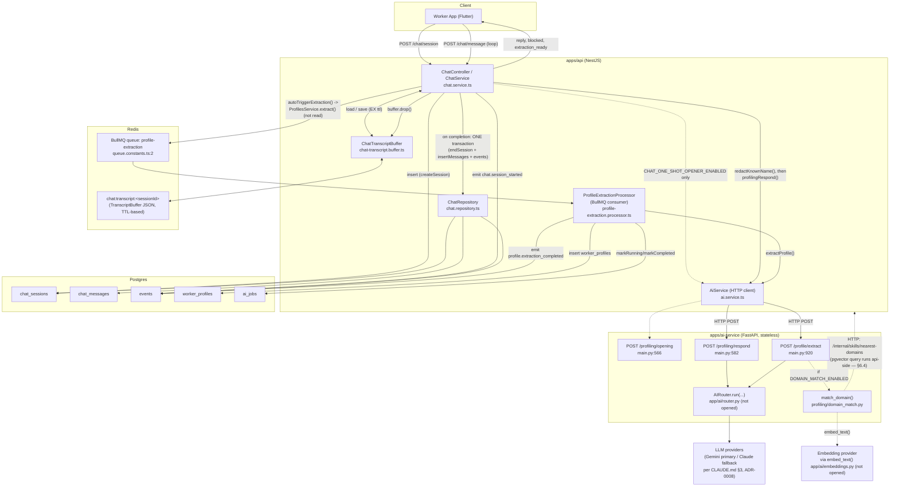

# BadaBhai — AI Profiling Architecture: Implementation Status Report

**Branch:** `feat/ai-chat-profiling` (PR #583) · **Date:** 2026-08-03 · **Status:** in development, not deployed

## Purpose and reading rules

This report describes **what exists in the codebase right now**. It is written so another
architect can plan remaining phases without re-reading the source and without guessing.

- Every factual claim carries a `file:line` citation. Claims were drafted by five
  independent passes over the code and then re-checked by a separate adversarial pass
  that re-opened the cited files, re-derived every number against committed defaults, and
  attempted to falsify every "not implemented" claim. That pass returned
  **NO DISCREPANCIES FOUND**.
- Four numbers in this report were produced by **executing** code against the live
  database rather than reading it: the catalogue counts (§6.7), the id-by-id
  reconciliation (§6.7), the duplicate-alias diagnosis (§15), and the cached-prefix token
  measurement (§9). Each is labelled as a live run.
- **Implemented / Partially Implemented / Not Started** are used strictly. "Partially
  Implemented" means the code path exists but is inert, unreachable, or unverified in a
  way that is stated explicitly.

## The one-paragraph summary

The deterministic interview engine is deleted. Every chat turn is now a real LLM call in
which the model writes its own question, adapted to whatever trade the worker actually
does; the service retains only the responsibilities a model must not hold — the privacy
gate, the turn budget, the persona's mechanically-checkable rules, the closed field
vocabulary, and the decision that the interview is over. Nothing is written to Postgres
during the interview: the transcript buffers in Redis and flushes once, transactionally,
at completion. A RAG occupation classifier is fully coded and its 4,071-row catalogue is
seeded and reconciled, but it is **double-inert** — disabled by flag, and unable to return
results even if enabled, because zero of its 8,695 aliases are embedded.

## What is NOT in this report

Sections describing the previous production architecture (the `question_bank.py` /
`interview_engine.py` design) are deliberately absent — those files do not exist in this
tree (verified, §4.0). Where current code comments still reference them, that is noted as
stale documentation, not as live behaviour.

---

# 1. Overall Architecture

## Scope of this section

This describes the components and call paths actually exercised by the LLM-driven worker-profiling chat: `apps/api/src/chat/*`, `apps/api/src/ai/ai.service.ts`, `apps/api/src/profiles/profile-extraction.processor.ts`, and `apps/ai-service/app/main.py`'s `/profiling/*` and `/profile/extract` handlers. Every box/arrow below is backed by a call site cited inline. Where a component exists in the codebase but is not on this chat path (e.g. the job-posting chat, skill embedding runners), it is named only to make an explicit boundary claim (e.g. "ai-service has no DB driver").

## Components found

- **Worker app** (Flutter) — posts to the chat endpoints; not re-read for this report; client-contract fields inferred from `apps/api/src/chat/chat.dto.ts` comments describing client contract fields (`session_ended`, chips) (`apps/api/src/chat/chat.dto.ts:40-56`).
- **NestJS API** (`apps/api`):
  - `ChatController`/`ChatService` — owns the interview turn loop (`apps/api/src/chat/chat.service.ts`).
  - `ChatTranscriptBuffer` — Redis-backed in-flight transcript (`apps/api/src/chat/chat-transcript.buffer.ts`).
  - `ChatRepository` — the only Postgres writer for chat data (`apps/api/src/chat/chat.repository.ts`).
  - `AiService` — typed HTTP client to the ai-service, with fail-open mock fallbacks on every method except `profilingRespond`/`profilingOpening`/`jobPostingChatRespond` (no-mock-fallback) and `probeHealth` (throws) (`apps/api/src/ai/ai.service.ts:88-415`).
  - `ProfileExtractionProcessor` — BullMQ consumer that calls `/profile/extract` and persists `worker_profiles` (`apps/api/src/profiles/profile-extraction.processor.ts:49-80`).
- **Redis** — two distinct uses on this path, both riding the *same* ioredis connection (the one BullMQ opened for the `profile-extraction` queue, reused deliberately so no second client is opened):
  1. The chat transcript buffer, key `chat:transcript:<sessionId>` (`apps/api/src/chat/chat-transcript.buffer.ts:130-132`, connection reuse at `:126-128,222-225` and `apps/api/src/chat/chat.module.ts:19-25`).
  2. The BullMQ `profile-extraction` job queue itself (`apps/api/src/queue/queue.constants.ts:2`; consumer `apps/api/src/profiles/profile-extraction.processor.ts:49-50`).
- **Postgres** — `chat_sessions`, `chat_messages` (`packages/db/src/schema.ts:538-624`), plus `events`, `ai_jobs`, `worker_profiles` (written by the processor, not the tables I opened directly for this section but referenced by `ProfilesRepository.create(...)` at `apps/api/src/profiles/profile-extraction.processor.ts:140-172`).
- **FastAPI ai-service** (`apps/ai-service/app/main.py`) — stateless per request. Relevant routes on this path: `/profiling/opening` (`main.py:566-579`), `/profiling/respond` (`main.py:582-810`), `/profile/extract` (`main.py:920-1211`). It also exposes `/pseudonymize`, `/embeddings/skill-alias`, `/skills/canonicalize`, `/growth/cluster`, `/skills/retag-plan`, `/job-posting-chat/*`, `/resume/generate`, `/voice/transcribe`, `/health`, `/ai/spend` — all present in the same file but outside the worker-chat path.
- **AIRouter** (`app/ai/router.py`, imported at `main.py:28`, instantiated `main.py:104`, called via `router.run(...)` at e.g. `main.py:676-682`) — the LLM call seam. Provider identity (Gemini primary, Claude Haiku fallback) is asserted by CLAUDE.md §3 as the locked stack (ADR-0008); `router.py`'s own source was not re-read for this report, so treat provider selection/fallback ordering as documented-but-unverified here. The two provider clients themselves (`gemini_client.py`, `anthropic_client.py`) *were* read — see §8.2.
- **Embedding calls** — `embed_text` (`app/ai/embeddings.py`, imported `main.py:24`) is called for `/embeddings/skill-alias`, `/skills/canonicalize`, and inside `match_domain` (`apps/ai-service/app/profiling/domain_match.py:285`). None of these three run on the chat-turn path itself (`/profiling/respond`); the domain-match embed call happens inside `/profile/extract`, gated by `settings.domain_match_enabled` (`main.py:1146`).
- **pgvector** — the ai-service has **no DB driver** and never queries Postgres directly. Its `DomainStore` protocol is explicitly documented as "Implemented over HTTP because the ai-service has no DB driver and `job_domain_alias` is RLS-locked; the api runs the query" (`apps/ai-service/app/profiling/domain_match.py:98-100`). The concrete implementation, `HttpDomainStore`, POSTs to the api's `POST /internal/skills/nearest-domains` (`domain_match.py:114-157`); that route's SQL and the pgvector index it uses are documented in §6.4 and §7. `app/ai/skill_store.py` follows the identical HTTP-seam pattern (`HttpSkillStore` at line 52, factory `get_skill_store` at line 107) for skill canonicalization. Separately, `main.py`'s own docstrings for `/embeddings/skill-alias` and `/growth/cluster` name standalone `packages/db/src/*.ts` runner scripts (`embed-skill-aliases.ts`, `growth-cluster.ts`, `retag-skills.ts`) that hold the actual DB connection and call the ai-service purely for compute (`main.py:320-322, 505-511, 542-550`); those runner scripts are outside the chat path.

## What does NOT exist

- **`/profiling/summarize`, or any conversation-summarization endpoint: NOT FOUND.** Searched `apps/ai-service` for `summarize|summary`; the only hits are (a) `RESUME_SYSTEM_PROMPT`'s "You write a short, plain worker summary from a structured profile" (`apps/ai-service/app/profiling/prompts.py:244-253`), which is the résumé-writing prompt, not a chat-memory operation; and (b) an explicit negative statement in `domain_match.py`: "NOT a prose summary, and that is a deliberate choice" (`domain_match.py:180`), arguing against building one for the retrieval query. No route, function, or job compresses/summarizes the chat transcript itself.
- **Direct ai-service → Postgres/pgvector connection: NOT FOUND.** See above — the seam is HTTP-only, in both directions the ai-service needs vector data.

## Diagram



---

# 2. Current Conversation Flow

## Session start — `ChatService.startSession` (`apps/api/src/chat/chat.service.ts:74-139`)

1. `workers.findById(workerId)` — read. 404 if missing (`:75-76`).
2. `chat.createSession(workerId)` — **Postgres write #1**: `INSERT INTO chat_sessions (worker_id, status='active')` (`chat.repository.ts:61-69`, called at `chat.service.ts:78`).
3. `events.emit("chat.session_started", ...)` — **Postgres write #2** into `events` (`chat.service.ts:79-87`).
4. If `CHAT_ONE_SHOT_OPENER_ENABLED` (default off, `packages/config/src/server.ts:625`): calls `AiService.profilingOpening()` → `POST /profiling/opening`. This text is **rendered by the client and never stored as a chat message** — it never enters `chat_messages` or the extraction transcript (`chat.service.ts:109-113`). No event is emitted for it (`:105-107`).
5. No buffer is created here. The buffer is created lazily on the first `postMessage` call.

## One turn — `ChatService.postMessage` (`apps/api/src/chat/chat.service.ts:162-357`)

**Step 0 — ownership + terminal check.**
- `chat.findSession(dto.session_id)`; 404 (never 403) if missing or `session.workerId !== workerId` (`:167-172`).
- If `session.status !== "active"`, return `terminalResponse()` — no LLM call, no buffer touch, no write (`:178-180`, `:564-579`).

**Step 1 — buffer load.**
- `buffer.load(dto.session_id)` reads Redis. Throws 503 (fail-closed) on a Redis error — never silently restarts (`chat-transcript.buffer.ts:154-175`, called `chat.service.ts:185`).
- If the buffer names a different `workerId` than the session row, it is discarded as a tripwire and treated as "no buffer" (`:186-195`).
- If `null` (first turn, or TTL lapse): a fresh buffer is created via `ChatTranscriptBuffer.create(workerId, DEFAULT_ROLE_FAMILY="cnc_vmc", now)` (`:196-215`, `:30`). If the session is older than `CHAT_TRANSCRIPT_TTL_SECONDS`, a warning is logged that earlier turns were lost — but the interview silently restarts either way (`:206-213`).
- **No Postgres read or write in this step.**

**Step 2 — turn budget.**
- `turnIndex = buffer.turnCount + 1`; `forceComplete = turnIndex >= CHAT_MAX_TURNS` (default 30, `packages/config/src/server.ts:645`, `chat.service.ts:220-221`). This is the API-side, authoritative cap — the model is still called on the final turn but told to close.

**Step 3 — redaction.**
- `workerFullName(workerId)` decrypts `workers.full_name` (read, no write) — used only to strip the worker's own name outbound; never logged/evented/sent to the LLM (`:713-726`).
- History window: `CHAT_HISTORY_WINDOW_TURNS` (default 20, `server.ts:651`) turns → `window*2` messages, sliced from `buffer.messages`, each redacted via `redactKnownName` (`:236-242`). The *stored* buffer content is untouched — redaction happens only on the copy sent outward.

**Step 4 — call `/profiling/respond`.**
- `ai.profilingRespond({session_id, worker_ref: workerId, message_text: redacted, history: redacted, conversation_state: {role_family, turn_count, captured}, role_family, force_complete})` (`:244-257`).
- On the ai-service side (`main.py:582-810`): pseudonymize `message_text` + every history leg + every `captured` value (fail closed, any leg blocking fails the whole turn) → build prompt via `build_chat_messages` → `router.run("profiling_chat_turn", ...)` → parse via `coerce_turn`/`fallback_turn` → optional persona-guard repair (one retry) → merge captured fields against the closed RFS vocabulary → **the service, not the model, decides `extraction_ready`** (`fields_done` or `cap_fired`) → return `ProfilingTurnOutput`.
- **No Postgres or Redis I/O inside the ai-service itself** — it is stateless per request (explicit design intent stated at `ai.service.ts:111`: "the remote service can conduct the interview without holding any per-session state itself").

**Step 5 — branch on result.**
- **`null`** (ai-service unreachable/timeout/non-2xx): **the buffer is not touched at all** — no message appended, no save. Client gets `CHAT_UNAVAILABLE_REPLY`, safe to retry (`:259-269`).
- **`aiResult.blocked === true`** (pseudonymization failed closed on the far side): also a no-op on the buffer — the blocked message never enters the transcript. This is called out as a privacy improvement over the old per-turn-write design, where a blocked message still landed in `chat_messages` before this rewrite (`:271-284`).
- **Success**: both lines are pushed to `buffer.messages` **verbatim** — the worker's raw `dto.text` and the assistant's raw reply carrying the literal `{{worker_name}}` placeholder (never the interpolated name) (`:286-293`). `buffer.turnCount`, `buffer.captured`, `buffer.roleFamily` are updated from `aiResult.updated_state` (`:295-298`).

**Step 6 — completion decision (API side, redundant-by-design with the ai-service's own decision).**
- `complete = aiResult.extraction_ready || forceComplete` — ORed defensively so a stale ai-service that didn't cap the turn still gets forced closed (`:315`, comment `:310-314`).
- If `complete`, `buffer.completedAt`/`buffer.completionReason` are set.

**Step 7 — buffer save.**
- `buffer.save(dto.session_id, buffer)` — Redis `SET key value EX <CHAT_TRANSCRIPT_TTL_SECONDS>`, resetting the TTL every turn (idleness-based expiry, not length-based) (`chat-transcript.buffer.ts:178-200`, default TTL 86,400s = 24h, `server.ts:639`). Bounded to the most recent `TRANSCRIPT_BUFFER_MAX_MESSAGES=600` lines (`chat-transcript.buffer.ts:115,179-189`). **Still no Postgres write.**

**Step 8 — finalize if complete.**
- `await this.finalizeInterview(...)` (only path to Postgres for this turn's content — see below).

**Step 9 — response.**
- Constructed field-by-field, `renderWorkerName` interpolates the real first name into the reply **only in this returned value**, never into anything stored (`:330-357`, `:739-757`).

## `finalizeInterview` — THE ONE WRITE (`chat.service.ts:377-488`)

Runs inside `chat.withTransaction(...)` (one Postgres transaction, `chat.repository.ts:44-46`):
1. `endSession(tx, sessionId, finalState, at)` — **conditional** `UPDATE chat_sessions SET status='ended', ... WHERE id=? AND status='active'`, returns whether it won (`chat.repository.ts:138-150`). If it lost (already finalized by a concurrent call), the transaction returns `false` and nothing else in it runs (`chat.service.ts:409-411`).
2. `insertMessages(tx, buffer.messages.map(toMessageRow))` — one multi-row `INSERT` into `chat_messages`, `created_at` set explicitly per buffered `at` timestamp so ordering survives the batch write (`:414-417`, `chat.repository.ts:56-59`, row shape `chat.service.ts:512-528`).
3. One `chat.message_received` / `chat.message_sent` event per stored row, same event names/payloads the old per-turn design used, emitted `WITH tx` (`:419-442`).
4. One `profile.extraction_ready` event (`:444-459`).
5. On any error inside the transaction: **rethrow is swallowed**, nothing is written, and the Redis buffer is left intact (with `completedAt` already set) for a retry on the next POST — the worker is never shown a 500 for this (`:462-473`).
6. If the transaction committed but this call lost the `endSession` race (`won === false`): just `buffer.drop(sessionId)` and return — another request's transaction already has the data (`:475-480`).
7. On success: `buffer.drop(sessionId)` (Redis `DEL`, **only after commit, never in `finally`** — `chat-transcript.buffer.ts:211-220`), then `autoTriggerExtraction(...)`.

## `autoTriggerExtraction` (`chat.service.ts:805-838`)

- Checks `workers.latestProfile(workerId)`; skips if an existing profile row has `hasExtractedContent()` true (dedupe against AI-down fabricated empty profiles, T3 fix) (`:810-817`).
- Calls `ProfilesService.extract({worker_id, session_id}, ctx)` — not re-read for this report; from the call site this returns `{ai_job_id}` synchronously, implying it creates the `ai_jobs` row and enqueues the BullMQ `profile-extraction` job before returning (`:828-831`).
- Never throws outward — a failed trigger is logged and swallowed; chat is unaffected (`:833-837`).

## Sequence diagram

```mermaid
sequenceDiagram
    participant App as Worker App
    participant API as ChatService (API)
    participant Redis as Redis (buffer)
    participant AI as ai-service
    participant PG as Postgres

    App->>API: POST /chat/session
    API->>PG: INSERT chat_sessions (status=active)
    API->>PG: emit chat.session_started
    API-->>App: {session_id, status, started_at}

    loop each turn (postMessage)
        App->>API: POST /chat/message {session_id, text}
        API->>PG: findSession (ownership + status read only)
        alt session not active
            API-->>App: terminalResponse() — no LLM, no writes
        else active
            API->>Redis: GET chat:transcript:<id>
            Redis-->>API: TranscriptBuffer or null
            API->>API: redactKnownName(text/history), build ProfilingTurnInput
            API->>AI: POST /profiling/respond
            AI->>AI: pseudonymize (fail closed) -> router.run -> persona guard
            AI-->>API: reply_text, captured, extraction_ready | blocked | (unreachable)
            alt AI unreachable
                API-->>App: CHAT_UNAVAILABLE_REPLY (buffer untouched)
            else blocked
                API-->>App: blocked reply (buffer untouched)
            else success
                API->>API: append worker+assistant lines to buffer (verbatim)
                API->>Redis: SET chat:transcript:<id> EX ttl (reset TTL)
                API-->>App: reply, chips, extraction_ready, session_ended
            end
        end
    end

    Note over API,PG: extraction_ready or turn-cap fires
    API->>PG: TRANSACTION: endSession (conditional UPDATE) + insertMessages (bulk INSERT) + per-message events + profile.extraction_ready event
    alt transaction fails
        API->>API: log error; leave Redis buffer intact for retry
    else transaction commits
        API->>Redis: DEL chat:transcript:<id>
        API->>API: autoTriggerExtraction -> ProfilesService.extract -> enqueue BullMQ job
    end
```

## Write summary (explicit)

| Step | Postgres write? | Redis write? |
|---|---|---|
| `startSession` | Yes — `chat_sessions` insert + `chat.session_started` event | No |
| Ownership/terminal check | No (read only) | No |
| Buffer load | No | No (read) |
| Redaction / history windowing | No | No |
| `/profiling/respond` call | No | No |
| AI unreachable / blocked branches | No | No |
| Successful turn append + save | No | Yes — `SET ... EX ttl` |
| `finalizeInterview` (completion turn only) | Yes — the one transaction | Yes — `DEL` after commit |
| `listMessages` (GET hydration) | No (read-only; falls back to Postgres read if no buffer) | No (read) |

---

# 3. Conversation Memory

Answering each sub-question literally, per file evidence.

**Is there Redis?** Yes. One key pattern: `chat:transcript:<sessionId>` (`chat-transcript.buffer.ts:130-132`), one JSON value per session containing the `TranscriptBuffer`: `workerId`, `turnCount`, `captured` (the RFS field map), `roleFamily`, `messages[]` (`role`, `text`, `at`), `startedAt`, optional `completedAt`/`completionReason` (`:57-91`). TTL is `CHAT_TRANSCRIPT_TTL_SECONDS` (default 86,400s / 24h, `packages/config/src/server.ts:639`), reset on **every** `save()` call — so it bounds idleness, not total interview length (`chat-transcript.buffer.ts:177-200`). It also caps at 600 buffered lines regardless of the turn cap, oldest dropped first (`:115,179-189`). It rides the same ioredis connection BullMQ opened for the `profile-extraction` queue — no second Redis client is created (`:126-128,222-225`; `chat.module.ts:19-25`).

**Is there Postgres storage mid-interview?** No, confirmed. `ChatService.postMessage`'s own doc comment states it directly: "NOTHING IS WRITTEN TO POSTGRES HERE" (`chat.service.ts:142-150`). The only Postgres writes on the whole chat path are (a) session creation at `startSession` (one row + one event, before any interview content exists) and (b) the single flush transaction in `finalizeInterview` when the interview completes (`:377-488`). Between those two points — however many turns occur — zero rows are written to `chat_messages`, and `chat_sessions.conversation_state` is not touched per turn either (it is only set once, inside `endSession`, at completion — `chat.repository.ts:138-150`).

**Is there a "session memory" concept distinct from the transcript buffer?** No. The `TranscriptBuffer` *is* the session's entire in-flight state. There is no separate cache entry, in-memory service field, or additional Redis key holding a parallel notion of "session memory." The `ConversationState` object (`captured`, `turn_count`, `role_family`, `completion_reason`, `unanswered_essentials`) that travels between the API and the ai-service on every call is built fresh from the buffer each turn (`chat.service.ts:249-254`) and is not itself persisted anywhere separately from the buffer — it is a wire-format view of the same three buffer fields (`captured`, `turnCount`, `roleFamily`). The ai-service holds **no per-session state of its own** — this is stated explicitly in `ai.service.ts:111`: "the remote service can conduct the interview without holding any per-session state itself." Every `/profiling/respond` call is a complete, self-sufficient request.

One additional, precise finding: the `ConversationState` schema (`packages/ai-contracts/src/index.ts:64-135`) also carries `collected`, `answered_topics`, `asked_question_ids`, `ask_counts`, `clarify_count`. A fixture comment in the contracts package states these explicitly: "`collected`, `answered_topics`, `asked_question_ids`, `ask_counts` and `clarify_count` are the deterministic engine's vestigial state, kept ONLY because dropping a shipped field would break invariant #8 for any session mid-flight at deploy time. **They are no longer populated.**" (`packages/ai-contracts/src/__fixtures__/profiling.keys.json:7`). This is corroborated in code: `ChatService.postMessage` never sets `collected` when building the request (`chat.service.ts:249-254`), and `main.py`'s `/profiling/respond` only ever carries it forward unchanged (`collected=prior.collected if prior else {}`, `main.py:789`) — it is never written to. So: these five fields exist in the type but are dead/inert memory, not a second memory system in active use.

**Is there ANY long-term memory across sessions (a worker's PRIOR interview influencing a NEW one)?** NOT IMPLEMENTED. `startSession` does not read any prior `chat_sessions`, `worker_profiles`, or `chat_messages` row to seed the new interview (`chat.service.ts:74-139`) — it only checks the worker exists. `ChatTranscriptBuffer.create()` always starts from `turnCount: 0, captured: {}` (`chat-transcript.buffer.ts:135-144`). The only place a prior profile is consulted at all is `autoTriggerExtraction`'s `workers.latestProfile(workerId)` check (`chat.service.ts:810-817`), and that is used purely to decide whether to *skip re-extracting a profile* after this session ends — it is never read into, or used to influence, the content of a new interview's questions or captured state.

**Is there any conversation summarization step?** NOT IMPLEMENTED. Searched `apps/ai-service` for `summarize|summary`; no endpoint or function compresses the chat transcript. The only "summary" in the codebase is `RESUME_SYSTEM_PROMPT`'s instruction to write "a short, plain worker summary from a structured profile" (`apps/ai-service/app/profiling/prompts.py:244-253`) — that is résumé prose generated from the already-extracted profile, run once at `/resume/generate`, not a memory-management step over the conversation. There is also an explicit design note rejecting a summary-shaped input for the domain-match retrieval query, on the grounds that a prose summary would dilute the trade signal (`apps/ai-service/app/profiling/domain_match.py:180-185`).

**Is there any semantic/embedding-based retrieval of past messages?** NOT IMPLEMENTED. Embeddings (`embed_text`, `app/ai/embeddings.py`) are used for skill-alias embedding (`/embeddings/skill-alias`), skill canonicalization (`/skills/canonicalize`), and job-domain retrieval inside `/profile/extract` (`match_domain`, `domain_match.py:260-370`) — none of these retrieve or rank *past chat messages*. The chat history that reaches the model each turn is exclusively the plain, recency-windowed slice of `buffer.messages` (`CHAT_HISTORY_WINDOW_TURNS`, default 20 turns → 40 messages, `chat.service.ts:236-242`; re-windowed again on the ai-service side by `PROFILING_HISTORY_MAX_TURNS`, default 20, `apps/ai-service/app/config.py:150`, applied at `main.py:655-660`) — there is no vector index over message content and no similarity search that pulls in non-adjacent turns.

**When is a message deleted, and when does it become permanent?**
- **Deleted / never persisted:** a turn where the ai-service is unreachable, or where `pseudonymize` blocked the input — in both cases nothing is ever appended to the buffer, so nothing is lost from a durable store because nothing was ever written there (`chat.service.ts:259-284`). A successfully buffered message is deleted only in two ways: (a) implicitly, by Redis TTL expiry if the interview goes idle past `CHAT_TRANSCRIPT_TTL_SECONDS` (`chat-transcript.buffer.ts` — no explicit code path, just key expiry) — the buffer, and every message in it, is silently gone, and the next `postMessage` treats it as turn one again (`chat.service.ts:196-215`); or (b) explicitly, via `buffer.drop(sessionId)` (`DEL`) called only *after* a successful flush transaction commits (`chat.service.ts:486`, never in a `finally`, `chat-transcript.buffer.ts:203-220`).
- **Becomes permanent:** only inside the `finalizeInterview` transaction — the moment `insertMessages` commits as part of that one atomic write (`chat.service.ts:414-417`, `chat.repository.ts:56-59`). Before that commit, a message exists nowhere durable; the `chat_sessions` row created at `startSession` is durable from turn zero, but it carries no message content, only ownership/status metadata until `endSession` stamps `conversation_state` at the very same commit (`chat.repository.ts:138-150`).
- **One caveat on content, not on timing:** what gets persisted is the buffer's *verbatim* text, including the worker's own raw words — `redactKnownName` is applied only to the copies sent to the ai-service, not to what is stored in the buffer or later written to `chat_messages` (`chat.service.ts:286-293`, comment on `BufferedMessage.text` at `chat-transcript.buffer.ts:44-55`). So a worker who types their own name mid-chat has it land, unredacted, in the permanent `chat_messages` row.

---

# 4. AI Conversation Engine

### 4.0 The old engine is deleted

`app/profiling/interview_engine.py` and `app/profiling/question_bank.py` do **not exist** in the current tree. `ls apps/ai-service/app/profiling/` lists: `__init__.py`, `canonical_roles.py`, `canonicalization_gold.py`, `domain_match.py`, `eval_canonicalization.py`, `miss_attribution.py`, `opener.py`, `persona.py`, `persona_guard.py`, `profile_extractor.py`, `prompts.py`, `rfs.py`, `signals.py`, `turn_schema.py` — no `interview_engine.py`, no `question_bank.py`. `prompts.py:3-7` states this directly: "THE CHAT TURN IS NO LONGER A REPHRASE. It used to be: a deterministic engine chose the question from a hardcoded bank and the model, when it was called at all, only put the chosen question into nicer words. The engine is gone." `rfs.py:1-9` corroborates: "THIS REPLACES THE QUESTION BANK. The old design encoded 7 hardcoded role families in 632 lines of Python… The model now invents its own questions for whatever trade the worker actually does."

A **sibling, unrelated** deterministic engine of the same name still exists at `app/job_posting_chat/interview_engine.py` + `app/job_posting_chat/question_bank.py`, used only by the **payer-facing** job-posting chat (`/job-posting-chat/respond`, `main.py:832-917`, ADR-0035) — a different domain (a payer describing a vacancy, not a worker profiling interview). `job_posting_chat/interview_engine.py:13` calls itself "A SIBLING of `app/profiling/interview_engine.py`, not a parameterization of it" — the comment is the only remaining trace that a worker-side file of that name ever existed; it does not today. `main.py:900-904` confirms this route makes **zero LLM calls** on every path ("ZERO LLM CALLS, on every path — the one place this route deviates from `/profiling/respond`"), so it is out of scope for this section, which covers the worker-profiling engine only.

Two settings in `config.py` are vestigial from the old engine and are not read by any current code path: `ai_profiling_rephrase_enabled` (`config.py:89`) and `ai_profiling_llm_every_turn` (`config.py:106`). Their own doc comments describe `interview_engine.needs_rephrase` / `interview_engine._next_topic` — functions that existed in the now-deleted `app/profiling/interview_engine.py`. Repo-wide grep confirms the only remaining reference to either name is a comment mentioning `ai_profiling_rephrase_enabled` in `app/job_posting_chat/prompts.py:22`, which explicitly says "Both files are outside this slice's scope." Neither flag is read anywhere in `main.py`, `router.py`, or `model_config.py`. NOT IMPLEMENTED / DEAD: these two settings exist in `Settings` but have no live reader in the new architecture.

### 4.1 How the model decides what to ask

There is no per-turn "chosen question" handed to the model. Every turn the model receives three things and writes its own question from them:

1. **The persona** (`persona.py` → rendered as `PERSONA_SYSTEM_BLOCK`, `persona.py:134-202`) — who it is, the Ten Laws, the exact vocabulary, and the phrasing-conversion examples ("A form asks 'What is your job role?' You ask 'Aap kya kaam karte hain?'", `persona.py:178`).
2. **The collection target** (`rfs.field_brief`, `rfs.py:138-157`) — the Resume Field Set (RFS): which fields are `required` (must be collected to close the interview) vs `optional` (recorded only if volunteered, never asked — Law 4). This list is built from `Settings.profiling_required_fields` / `profiling_optional_fields` (`config.py:123-136`), i.e. it is config, not code — adding a field is an env edit.
3. **Turn-specific state** (`prompts.turn_context_message`, `prompts.py:70-121`) — an `ALREADY ANSWERED` list built from `captured` (so the model does not re-ask, Law 8), a `STILL MISSING` list built from `rfs.missing_required`, the current turn number out of the configured max, and — if `role_family` is known — a one-line trade hint explicitly marked "a hint only — believe the worker over this" (`prompts.py:92`).

There is no question bank, no per-topic priority order, and no per-trade code path. The model is free to ask about the missing fields "in any order that follows the conversation naturally" (`rfs.py:149`). Ordering, phrasing, and follow-up judgement are 100% the model's responsibility; the service's responsibility is exclusively: privacy gating, telling the model what is missing, enforcing the persona's mechanically-checkable rules, deciding completion, and merging captured data into a closed vocabulary.

### 4.2 The strict JSON turn contract

Every turn the model must return one JSON object matching `turn_schema.LlmChatTurn` (`turn_schema.py:29-48`):

```
reply:        str   — the line the worker reads (ack + one question, <20 words)
chips:        list[str] — tap-to-answer options for this question, 0..MAX_CHIPS(4)
asked_field:  str | None — the RFS field id this turn is asking about
captured:     dict[str, str] — field ids the worker has now answered
is_complete:  bool  — ADVISORY only
```

`json_mode` is on for this route (`model_config.py:46-48`, `"profiling_chat_turn": ("capable", True)`), and the Gemini transport sets `responseMimeType: application/json` (`gemini_client.py:141-142`) so the model is forced to emit a bare JSON object rather than a chatty preamble. `turn_schema.coerce_turn` (`turn_schema.py:79-126`) parses the raw string, tolerating a stray ` ```json ` fence, validates it against `LlmChatTurn`, and returns `None` on any parse/validation failure rather than raising — the caller then uses `fallback_turn` (`turn_schema.py:146-155`).

**TRUSTED vs ADVISORY, field by field:**

- `reply` — the text the worker will see, but it is not trusted as-is: it is run through the mechanical persona guard (§4.3) before being served, and can be replaced by a repaired or fallback reply.
- `chips` — bounded and de-duplicated by `coerce_turn` itself (`turn_schema.py:110-124`, strips >40-char chips, dedupes case-insensitively, truncates to `MAX_CHIPS`); not filtered against any known-answer vocabulary.
- `asked_field` — **not validated against the closed RFS field vocabulary anywhere in the turn path.** It is used only as an input to the persona guard's "never re-ask" check (`main.py:715-716`, `already_captured=frozenset(masked_captured)`) and is echoed verbatim to the API as `asked_question_id` (`main.py:794-805`). Unlike `captured`, there is no `rfs.normalize_captured`-style filter on `asked_field`; a model-invented field id passes through unchanged.
- `captured` — **filtered**, not trusted verbatim: `rfs.normalize_captured` (`rfs.py:90-117`) keeps only keys in `rfs.known_fields(settings)` (the closed RFS vocabulary), stringifies/trims values, drops empty values, and truncates to `_MAX_VALUE_CHARS = 120` (`rfs.py:120`). Dropped keys are counted and logged (`main.py:765-767`) but never stored.
- `is_complete` — **explicitly advisory.** `turn_schema.py:14-17`: "`is_complete` is ADVISORY — the endpoint decides, because a model told 'say when you have enough' will say so on turn two for a terse worker, and completion is irreversible downstream." The service only honours it in conjunction with `fields_done` (§4.5), and — as shown below — the combination with `fields_done` is in practice a no-op: `fields_done` alone already forces completion.

### 4.3 The persona guard: mechanical enforcement, repair loop, and its stated boundary

`persona_guard.py` is a separate enforcement layer over the model's `reply`, run only when `settings.profiling_persona_guard_enabled` is true (default `True`, `config.py:159`). Per its own docstring (`persona_guard.py:1-28`):

**Enforced mechanically (`persona_guard.check_turn`, `persona_guard.py:113-210`):**
- Exactly one `?` — `MAX_QUESTION_MARKS = 1` (Law 1). Zero marks → `no_question`; more than one → `multi_question`.
- Reply length ≤ `max_words` (`settings.profiling_max_reply_words`, default 20, `config.py:160`) → else `too_long`.
- No exclamation mark (`_EXCLAMATION_RE`), no emoji (`_EMOJI_RE`, a Unicode range scan).
- No banned vocative / tu-form / gush / promise / deictic word, from `persona.all_banned_tokens()` (`persona.py:205-214`), whole-word matched (`persona_guard._has_word`, `persona_guard.py:106-110`) — Laws 6, 7, 9, 10.
- The acknowledgement, if the reply opens with one, must come from the closed `ACKNOWLEDGEMENTS`/`APPRECIATIONS` set (advisory-flagged as `unknown_acknowledgement`, see the code comment at `persona_guard.py:176-179`: "Advisory rather than hard: the model may open straight into the question, which is legal.").
- The appreciation budget across the whole conversation: max `MAX_APPRECIATIONS_PER_CONVERSATION = 2` (`persona.py:55`), never before turn `MIN_TURN_BEFORE_APPRECIATION = 3` (`persona.py:56`), never twice consecutively, never on a turn where the worker just said "nahi pata" — computed from the *buffered transcript* via `persona_guard.count_appreciations` (`persona_guard.py:227-238`), not from an in-memory counter, "so it stays correct across a resumed session."
- Never re-asks an already-captured field (Law 8): `asked_field in already_captured` → `re_asks_captured_field`.

Two "Bada Bhai" / "Guarantee nahi de sakta" exemptions are stripped from the text before scanning (`_scannable`, `persona_guard.py:99-104`) so the brand name and the one sanctioned promise-shaped refusal line do not trip the vocative/promise bans.

**Explicitly NOT enforced — the docstring's own boundary (`persona_guard.py:19-23`):**
> "Never grade the person", "praise proportionate to the claim", "same warmth, plainer voice for a trade we don't cover" are judgements. A keyword heuristic for them would reject good turns... Those stay in the prompt and are evaluated, never asserted.

These, plus anything else in the Ten Laws that is not a string/count check (e.g. Law 2 "never repeat/restate/summarise what the worker just said", Law 3 "never explain why you are asking", the "same person, plainer voice" trade-fallback behaviour), are prompt-only: requested of the model in `PERSONA_SYSTEM_BLOCK`, never mechanically verified.

**The repair-retry loop** (`main.py:688-760`, inside `profiling_respond`, not inside `persona_guard.py` — "THE REPAIR LOOP lives in the endpoint, not here: this module only ever REPORTS," `persona_guard.py:25-27`):
1. `check = _check(turn.reply, turn.asked_field)`.
2. `attempts = settings_now.profiling_persona_repair_retries` (default `1`, range 0-3, `config.py:163`). While `not check.ok and attempts > 0`: log the violation `codes` (never the human-readable `violations`, which can echo a slice of the worker's own words back — `persona_guard.py:80-86`, `main.py:724-733`), make **one more real router call** with `persona_guard.repair_instruction(check)` appended as a trailing `system` message (`persona_guard.py:213-224`: "Your previous reply broke these rules: … Rewrite it. Same meaning, same question, obeying every rule."), re-parse, re-check, decrement `attempts`.
3. **On final failure** (still `not check.ok` after the retry budget is exhausted, or the repaired output fails to parse): the turn is replaced with `fallback_turn(...)` (`main.py:750-760`) — a safe, content-free, persona-conformant templated turn (`turn_schema.py:143-155`, `_FALLBACK_REPLY = "Theek hai. Thoda aur bataiye — aap kya kaam karte hain?"`). It captures nothing and claims no completion — "a provider outage costs a turn, never a topic" (`turn_schema.py:138`).

With `profiling_persona_repair_retries = 1` (the default), this is at most **one repair call per violating turn** — a `while` loop shaped to support up to 3 by config, but defaulting to a single retry.

The exact hoisting bug note at `main.py:696-702` documents a specific defect that was fixed: the first check and the repair re-check now share the same `appreciations_used`/`previous_had_appreciation` values, computed once before the loop — previously the re-check reset them to `0`/`False`, which meant the appreciation-budget and consecutive-appreciation rules could never fire on a repaired reply.

### 4.4 Missing-field detection

`rfs.missing_required(captured, settings)` (`rfs.py:123-129`) returns the subset of `settings.profiling_required_field_list` for which `captured.get(f)` is falsy, **in the configured field order** (not dict-iteration order — "so the nudge names the fields in the priority the operator set"). It is computed twice per turn in `profiling_respond`: `missing_before` (fed into the prompt as `STILL MISSING`, `main.py:654`) and `missing_after` (computed on the merged captured map after this turn's new captures are folded in, `main.py:769`, used for completion). `rfs.is_complete` (`rfs.py:132-135`) is a thin wrapper: `not missing_required(...)`; it is defined but `profiling_respond` inlines the equivalent check itself as `fields_done = not missing_after` (`main.py:778`) rather than calling `rfs.is_complete` — both are logically identical, `rfs.is_complete` is simply not the function actually called in this path (it is exercised elsewhere/by tests, not verified here).

### 4.5 Completion detection — the exact expression

From `main.py:777-784`:

```python
cap_fired = body.force_complete or turn_index >= settings_now.profiling_max_turns
fields_done = not missing_after
extraction_ready = cap_fired or (turn.is_complete and fields_done) or fields_done
completion_reason = (
    "turn_cap" if cap_fired and not fields_done
    else "fields_complete" if fields_done
    else None
)
```

`body.force_complete` is set by the caller (apps/api) when its own turn-count logic has already decided to stop (`contracts.py:152-157`: "The API's turn cap fired... The cap is API-authoritative on purpose: a model must never be able to extend its own interview, and the ai-service holds no per-session state to count turns with"). `profiling_max_turns` defaults to 30 (`config.py:144`).

Because `extraction_ready` is an OR of three terms and the third term is the bare `fields_done`, the middle term `(turn.is_complete and fields_done)` can never change the result on its own: whenever it is `True`, `fields_done` is also `True`, so the third disjunct already made the whole expression `True`. The model's `turn.is_complete` value therefore has **no observable effect on `extraction_ready`** as written — the boolean is logically equivalent to `cap_fired or fields_done`. This is consistent with, and is the concrete mechanism behind, the "advisory" claim in `turn_schema.py:14-17`: the model's self-declared completion is read into the expression but is never the deciding factor.

`completion_reason` is assigned by the service only (never model-supplied — mirrored in `ConversationState.completion_reason`'s own comment, `contracts.py:136-138`: "Never model-supplied — the endpoint assigns it, because the model does not get to decide that it is finished").

### 4.6 Deterministic vs AI responsibilities — summary

| Responsibility | Who |
|---|---|
| What fields exist, required vs optional | Config (`profiling_required_fields`/`profiling_optional_fields`) — deterministic |
| Question wording, ordering, follow-ups | Model — free-form |
| Persona voice (Ten Laws, vocabulary) | Model, prompted; mechanically-checkable subset enforced by `persona_guard` |
| Judgement-based persona rules (Law 2, 3, tone calibration) | Model only, never verified |
| Which fields are "already answered" / "still missing" | Deterministic (`rfs.missing_required` fed into the prompt) |
| What the model may record into `captured` | Filtered to a closed vocabulary (`rfs.normalize_captured`) — deterministic |
| Whether the interview is over | Deterministic (`main.py:777-784`); model's opinion (`is_complete`) is read but mathematically inert given the current expression |
| Turn/cost cap | Deterministic, config + caller-supplied `force_complete` |
| Privacy gate (pseudonymization) | Deterministic, fail-closed, runs before every model call (`main.py:602-648`) |

---

# 5. Resume Variables

## 5.1 Source of the field list

The Resume Field Set (RFS) is entirely config-driven. Two env vars, parsed by `config.py`, are the only place the vocabulary is declared:

- `PROFILING_REQUIRED_FIELDS` — committed default in `apps/ai-service/.env.example:52`:
  `trade,skills,experience_years,current_city,preferred_locations,salary_expected,availability`
- `PROFILING_OPTIONAL_FIELDS` — committed default in `apps/ai-service/.env.example:55`:
  `tools_equipment,salary_current,education_level,education_field,certifications,work_history,languages,relocation_willingness`

Same defaults are hardcoded as the `Settings` field defaults in `apps/ai-service/app/config.py:123-136`, so an `.env`-less boot gets the identical 7+8 list. Parsing is via `_parse_csv` (`config.py:23-30`) — comma-split, trimmed, blank-dropped, **order-preserving** (`dict.fromkeys`, not a set) because order is the priority the model is told to work through (`config.py:145` / `rfs.py:124-129`).

Two startup validators guard this config (both raise `ConfigError`, not `ValueError`, per `config.py:33-49`):
- `_validate_required_fields` (`config.py:511-533`): rejects an **empty** `PROFILING_REQUIRED_FIELDS` at `Settings()` construction — an empty required set would make every interview "complete" on turn one.
- `_validate_field_id_shape` (`config.py:535-567`): every id (required or optional) must match `[a-z_]{1,40}` and the combined list must be ≤50 entries, because the same ids later populate the `profile.extraction_ready` event payload, whose schema enforces `^[a-z_]+$`/max-40/max-50 **inside the flush transaction** — a bad id there rolls back the whole transaction and discards a completed interview.

`profiling_optional_field_list` (`config.py:579-590`) additionally drops any id that also appears in the required list, so a field listed in both ends up **required only**.

## 5.2 Field table

Every "answered" determination in code is the same one line, `missing_required` (`rfs.py:123-129`): `not captured.get(f)` — i.e. **presence of any non-empty string**, nothing more. There is no per-field semantic, type, or range check anywhere in `rfs.py`, `config.py`, or the `profiling_respond` handler (`main.py:582-810`). The "what triggers answered" column below is therefore identical for all 15 fields; it is stated once per row for completeness since the task asks for a full table, but the underlying logic is one function, not fifteen.

| field id | required/optional | what triggers "answered" | per-field confidence score |
|---|---|---|---|
| `trade` | required | `captured["trade"]` is a non-empty string after `normalize_captured` (whitespace-joined, ≤120 chars) — presence only, no content check | NOT IMPLEMENTED |
| `skills` | required | same presence-only check; value is a flat string (not a list) since `captured` is typed `dict[str, str]` (`contracts.py:135`) | NOT IMPLEMENTED |
| `experience_years` | required | same presence-only check; no numeric parse/validation (see 5.4) | NOT IMPLEMENTED |
| `current_city` | required | same presence-only check | NOT IMPLEMENTED |
| `preferred_locations` | required | same presence-only check; value is a flat string, not a list | NOT IMPLEMENTED |
| `salary_expected` | required | same presence-only check; no numeric parse/validation (see 5.4) | NOT IMPLEMENTED |
| `availability` | required | same presence-only check; no enum validation against `Availability`/`_AVAILABILITY` (that enum lives only in the separate `profile_extractor.py` path, not in `rfs.py`) | NOT IMPLEMENTED |
| `tools_equipment` | optional | same presence-only check; never gates `is_complete` (`rfs.py:132-135`); captured only if the model writes the key | NOT IMPLEMENTED |
| `salary_current` | optional | same, never gates completion | NOT IMPLEMENTED |
| `education_level` | optional | same, never gates completion | NOT IMPLEMENTED |
| `education_field` | optional | same, never gates completion | NOT IMPLEMENTED |
| `certifications` | optional | same, never gates completion | NOT IMPLEMENTED |
| `work_history` | optional | same, never gates completion | NOT IMPLEMENTED |
| `languages` | optional | same, never gates completion | NOT IMPLEMENTED |
| `relocation_willingness` | optional | same, never gates completion | NOT IMPLEMENTED |

`is_complete(captured, settings)` (`rfs.py:132-135`) is simply `not missing_required(...)` — every required field truthy. Optional fields are never read by `is_complete` or `missing_required` at all; they only ever enter `captured` if the model spontaneously emits that key (`field_brief`, `rfs.py:138-157`, explicitly instructs the model: "RECORD THESE ONLY IF THE WORKER VOLUNTEERS THEM. Never ask for them").

## 5.3 Confidence scoring — searched, not found for RFS fields

`grep "confidence" apps/ai-service/app/profiling/` surfaces exactly two files, neither of which is `rfs.py`:

- `domain_match.py:226,255,341,345,363` — a confidence value, but this is the **job-domain match** confidence (the LLM's self-reported pick confidence, `domain_match.py:255` `data.get("confidence")`), used once at the end of the interview to select a `job_domain_id`. It is not per-RFS-field, and the code itself flags it as inferior evidence: `domain_match.py:363` notes "One is measured, the other is asserted; only the measured one belongs" — the *measured* one being the retrieval cosine `score` in `JobDomainMatchSchema` (`packages/ai-contracts/src/index.ts:228-241`, mirrored `contracts.py`), not the model's `confidence` field.
- `profile_extractor.py:109` — `draft.confidence_score = round(min(0.3 + 0.15 * core_filled, 0.95), 2)`, a **single overall** score on `WorkerProfileDraft`, computed from exactly four fields (`primary_role, machines, experience_years, current_city`, `profile_extractor.py:107`) — a different, smaller field set than the 15-field RFS, and computed by a heuristic count of how many of those four are non-empty, not a confidence in any individual RFS field.
- `profile_extractor.py:173` — `DraftProfile.confidence = 0.4 if (sig.role_id or sig.machine_ids or sig.skill_ids) else 0.1` — a coarse binary-ish overall score on the legacy shape, likewise not per-field.

Critically, **neither of the two `profile_extractor.py` confidence values is derived from, or connected to, `ConversationState.captured`** — see §5.5.

**NOT IMPLEMENTED — no per-field confidence scoring exists for the RFS; RFS completion is presence/absence only.** The only numeric confidence in the profiling path is the job-domain match score, and it is a retrieval similarity, not an RFS-field confidence.

## 5.4 Value shape, bounding, and format validation

`normalize_captured` (`rfs.py:90-117`) is the sole transform applied to a model's `captured` map:

- Non-dict input → `({}, [])`.
- Each value is stringified and whitespace-collapsed: `text = " ".join(str(value).split())` (`rfs.py:113`).
- Empty-after-collapse values are dropped — "the model wrote the key with an empty value" must not read as "the worker answered" (`rfs.py:96-98`).
- Every kept value is hard-truncated to `_MAX_VALUE_CHARS = 120` characters (`rfs.py:116,120`). This is the only length bound in the module.

There is **no format/type validation of any kind** — `experience_years` and `salary_expected` are stored as free strings, never parsed to a number. `str(value).split()`/`join` is applied whether the model sent `"5"`, `5`, `5.0`, or `"5 saal, kabhi kabhi 6"` — all become a string, capped at 120 chars, and treated identically by `missing_required`. There is no numeric coercion, no currency/period parsing (unlike the separate `SalaryExpectation`/`Availability` typed models in `contracts.py:211-234`, which belong to the unrelated `DraftProfile` shape — see §5.5). `availability` is likewise not checked against the `Literal["immediate","notice_period","not_looking","unknown"]` enum defined elsewhere in `contracts.py:232-234`; that enum is never referenced by `rfs.py`.

**Unknown/invented field ids**: `normalize_captured` enforces a closed vocabulary via `known_fields(settings)` (`rfs.py:80-87`, `frozenset(settings.profiling_all_fields)`). Any key not in that frozenset is dropped:
```python
for key, value in captured.items():
    if key not in allowed:
        dropped.append(str(key))
        continue
```
(`rfs.py:107-110`). The docstring states the rationale explicitly: "Anything else is DROPPED rather than stored — the same fail-safe posture the extraction path takes with model-invented taxonomy ids. A model that hallucinates a field name should cost us one ignored key, not a junk column in a resume." (`rfs.py:80-86`). The caller, `main.py:765-767`, logs the dropped keys at `info` level (`"dropped unknown captured fields"`) but never surfaces them to the worker or persists them.

## 5.5 How "missing" drives the next turn

`missing_required` (`rfs.py:123-129`) returns required fields with no captured value, in configured order. `main.py:654` computes `missing_before` from the prior turn's masked `captured` and passes it into `build_chat_messages(... missing=missing_before ...)` (`main.py:662-673`), which reaches `turn_context_message` in `prompts.py`. There, when `missing` is non-empty, the prompt appends a line:
```python
"STILL MISSING: " + ", ".join(FIELD_LABEL.get(m, m) for m in missing) + "."
```
(`prompts.py:102-104`), using the human labels from `FIELD_LABEL` (`rfs.py:53-69`). This is the only mechanism by which "missing" reaches the model — full construction of that prompt is covered in Section 8, referenced here only to name the connection. After the model replies, `main.py:769` recomputes `missing_after` from the merged `captured`, and that list is what `completion_reason`/`extraction_ready` gate on (`main.py:777-784`) and what is written onto `updated_state.unanswered_essentials` (`main.py:792`).

## 5.6 Downstream extraction shape — `captured` is not consumed there

The task frames `captured` as feeding "downstream extraction." Verified in code: **it does not, directly.**

- `ConversationState.captured` (`contracts.py:135`, mirrored `ConversationStateSchema.captured` in `packages/ai-contracts/src/index.ts:127`) is read in only four places in the whole service (`grep` over `apps/ai-service/app`): `main.py:619,624,668,790` (all inside `/profiling/respond`), `prompts.py:152` (building the turn prompt), `rfs.py:129` (`missing_required`), and `turn_schema.py:153` (a test/mock default `captured={}`). No file passes `ConversationState.captured` into `profile_extractor.py`, `DraftProfile`, or `WorkerProfileDraft`.
- `/profile/extract` (`main.py:920-1040+`) takes `ProfileExtractionInput` (`contracts.py:529-534`: `worker_ref, language, transcript, messages, role_family`) — **no `captured` field exists on this input contract.** Extraction re-derives everything independently from raw transcript text (`worker_text`/`llm_text` built at `main.py:944-951`) via `profile_extractor.extract()` → `signals.detect()` (a keyword/regex heuristic, `main.py:985`), plus an optional real-LLM overlay (`profile_extractor.merge_model_draft`, `main.py:1034`) that also reads the transcript directly, never the RFS `captured` dict.
- The two field vocabularies do not name-match. RFS ids are `trade, skills, experience_years, current_city, preferred_locations, salary_expected, availability, tools_equipment, salary_current, education_level, education_field, certifications, work_history, languages, relocation_willingness`. `WorkerProfileDraft` (`contracts.py:280-324`) instead has `primary_role, machines, controllers, current_salary, expected_salary, current_city, preferred_locations, ...` — some names overlap (`current_city`, `preferred_locations`, `education_level`, `education_field`, `certifications`), most do not (`trade`→`primary_role`, `salary_expected`→`expected_salary`, `salary_current`→`current_salary`, `skills`/`tools_equipment`→`skills`/`machines`/`controllers` split), and there is no glue code anywhere in `apps/ai-service` that performs this rename/merge from `captured` — the extraction endpoint's field population comes entirely from re-parsing the transcript text, independent of whatever the RFS interview already captured in `captured`.

**PARTIALLY IMPLEMENTED, from a whole-pipeline view**: the RFS (`captured`) fully drives conversation completion (`is_complete`/`missing_required`/`extraction_ready`), but nothing in the codebase carries those captured key/value pairs into the `/profile/extract` request or the `WorkerProfileDraft`/`DraftProfile` output — extraction is a second, independent pass over the raw transcript with its own (non-RFS) field vocabulary and its own confidence numbers (§5.3). What connects the two today is only that `/profile/extract` is presumably called after `extraction_ready=true` (that call site is in `apps/api`, outside this file's scope) — the payload itself carries no RFS state.

---

# 6. Occupation Classification

## 6.1 Two classification schemes, one catalog

`packages/db/src/schema.ts` defines a single table pair — `job_domain` / `job_domain_alias` (migration 0066) — that holds rows from **two published standards**, distinguished by the `source` column (`packages/db/src/schema.ts:2515`, `type JobDomainSource = "isco08" | "nco2015" | "rvm"`):

- **ISCO-08** (International Standard Classification of Occupations) — seeded from `isco08.jsonl` in the corpus directory. 619 rows (confirmed by running `audit-job-domains.ts`, output below).
- **NCO-2015** (India's National Classification of Occupations) — seeded from `nco2015.jsonl`. 3,452 rows.
- **`rvm`** — a third, currently-unused source value reserved for rows BadaBhai mints itself when neither published standard covers an occupation (`packages/db/src/job-domain-corpus.ts:104-114`, `jobDomainIdFor`: `rvm` rows use an `id_slug` instead of a scheme code because "there is no code to derive an id from"). No `rvm` rows exist in the current corpus (audit output shows only `isco08` and `nco2015` in `bySource`).

There is no separate ISCO table and NCO table — both schemes live in the same `job_domain` row space, distinguished by `source` + `source_code`, and related to each other via the hierarchy mechanism in §6.3.

## 6.2 Schema — `job_domain`

Full column list, `packages/db/src/schema.ts:2542-2627`:

| Column | Type | Notes |
|---|---|---|
| `job_domain_id` | text, PK | Minted, never a raw code (see §6.3.1 for derivation) |
| `label_en` | text, NOT NULL | |
| `label_hi` | text, nullable | |
| `description_en` | text, nullable | |
| `source` | text, NOT NULL | `isco08` \| `nco2015` \| `rvm` |
| `source_code` | text, nullable | The published code (`"7223"` for ISCO, `"7223.0100"` for NCO). NULL only for `rvm` rows |
| `level` | smallint, NOT NULL | 1–5. Levels 1–3 are ISCO major/sub-major/minor buckets; 4 is the ISCO unit group; 5 is the NCO India-specific suffix |
| `parent_job_domain_id` | text, self-FK, nullable | See §6.3 |
| `isco_major_code` | text, nullable | Denormalized ancestor code |
| `isco_unit_code` | text, nullable | Denormalized ancestor code |
| `skill_level` | smallint, nullable | ISCO-08 skill level 1–4, "DESCRIPTIVE ONLY — never an input to ranking (invariant #4)" (schema.ts:2567-2569) |
| `industry_id` | text, nullable | `ind_*` from `@badabhai/taxonomy` `INDUSTRIES`; no FK (TS constant, not a table) |
| `canonical_role_id` | text, nullable | Crosswalk to the legacy 13-role space — see §6.3.2 |
| `selectable` | boolean, NOT NULL, default false | May a worker profile point at this row |
| `status` | text, NOT NULL, default `active` | `active` \| `provisional` \| `deprecated` |
| `version` | integer, NOT NULL, default 1 | |
| `replaced_by` | text, self-FK, nullable | Deprecation crosswalk |
| `created_at` / `updated_at` | timestamptz | |

**CHECK constraints** (`schema.ts:2600-2625`):

- `job_domain_source_chk`: `source IN ('isco08','nco2015','rvm')`
- `job_domain_status_chk`: `status IN ('active','provisional','deprecated')`
- `job_domain_level_chk`: `level BETWEEN 1 AND 5`
- `job_domain_skill_level_chk`: `skill_level IS NULL OR skill_level BETWEEN 1 AND 4`
- `job_domain_selectable_leaf_chk`: `selectable = false OR level >= 4` — "a bucket is not an occupation ... a selectable bucket would let the matcher place a worker in 'Craft and Related Trades Workers' and call it a job"
- `job_domain_source_code_chk`: `source = 'rvm' OR source_code IS NOT NULL` — only a minted row may omit a published code
- `job_domain_replaced_by_chk`: `replaced_by IS NULL OR status = 'deprecated'`
- `job_domain_no_self_parent_chk`: `parent_job_domain_id IS NULL OR parent_job_domain_id <> job_domain_id`

**Indexes** (`schema.ts:2589-2599`): `job_domain_source_code_uq` (unique on `source, source_code`), `job_domain_parent_idx` (FK column), `job_domain_selectable_idx` (on `selectable, status` — "the retrieval pre-filter"), `job_domain_isco_unit_idx` (branch-scoped retrieval without a recursive CTE).

## 6.2.1 Schema — `job_domain_alias`

`schema.ts:2638-2667`:

| Column | Type | Notes |
|---|---|---|
| `id` | uuid, PK | |
| `job_domain_id` | text, FK → `job_domain`, `ON DELETE CASCADE`, NOT NULL | |
| `text` | text, NOT NULL | The alias phrase — "kharad operator", "silai wala" |
| `lang` | text, nullable | `LanguageCode` |
| `source` | text, NOT NULL | Same `JobDomainSource` enum |
| `embedding` | vector(768), nullable | See §7 |
| `embedding_model` | text, nullable | Provenance — see §7 |
| `embedded_at` | timestamptz, nullable | |
| `created_at` | timestamptz | |

CHECK: `job_domain_alias_source_chk`: `source IN ('isco08','nco2015','rvm')`. No CHECK on `lang`.

Comment at `schema.ts:2633-2637`: "WE EMBED THE ALIASES, NOT THE CANONICAL LABEL ... a worker describes their trade in their own words, and the official title ('Metal Working Machine Tool Setters and Operators') is the one phrasing nobody uses."

## 6.3 Hierarchy mechanism

`parent_job_domain_id` is a self-FK on `job_domain` (`schema.ts:2558-2560`). Resolution of parent pointers happens entirely in `packages/db/src/job-domain-corpus.ts`, not in the DB:

- Each corpus record (`JobDomainSeedRecord`, `job-domain-corpus.ts:51-83`) carries `parent_code` (the parent's *published* code, not a `job_domain_id`) and an optional `parent_source` field.
- `parent_source` "defaults to this row's own source" (`job-domain-corpus.ts:65-72`). It exists specifically for NCO-2015 rows: NCO's 8-digit codes are ISCO-aligned on their leading four digits, so an NCO level-5 row's parent is looked up in the **ISCO** scheme (`parent_source: "isco08"`), not in NCO. The comment states: "NCO's 8-digit codes are ISCO-aligned on their leading four digits by construction ... Letting them SAY so keeps a single hierarchy: ISCO levels 1-4 organise, NCO level 5 is what a worker actually is."
- `resolveJobDomainCorpus` (`job-domain-corpus.ts:272-293`) builds a `(source, code) -> resolved record` map (`byKey`), then for every record with a `parent_code` looks it up under `parent_source ?? source` and sets `parentJobDomainId` to the resolved id.
- `validateJobDomainCorpus` (`job-domain-corpus.ts:147-269`) enforces: level-1 rows must have no parent; level>1 rows must have a `parent_code`; the parent must exist in the referenced scheme's corpus (else "a truncated scrape leaves orphans like this"); the parent's `level` must equal `row.level - 1`.
- `seed-job-domains.ts` writes domains in two passes specifically because of this self-FK: pass 1 inserts every row with `parent_job_domain_id = NULL` (`seed-job-domains.ts:98-144`), pass 2 UPDATEs the parent pointer for every row once all rows exist (`seed-job-domains.ts:146-170`), "because `job_domain.parent_job_domain_id` is a SELF-FK, so a level-4 row inserted before its level-3 parent would fail the FK."

### 6.3.1 ID derivation

`jobDomainIdFor` (`job-domain-corpus.ts:104-114`): IDs are **minted, never the raw code**, to avoid a composite `(scheme, code)` PK (ISCO `"7223"` and NCO `"7223.0100"` collide in text space). For `isco08`/`nco2015` rows: `jd_isco_<code>` or `jd_nco_<code with dots replaced by underscores>`. For `rvm` rows: `jd_rvm_<slugified id_slug>`. IDs are documented as "IMMUTABLE + APPEND-ONLY, same discipline as `skill` (SG-5): a job_domain_id is never renamed or reused" (`schema.ts:2504-2506`).

### 6.3.2 Crosswalk to the legacy 13-role space

`canonical_role_id` on `job_domain` is a nullable, unenforced (no FK — `ROLES` is a TS constant) pointer into the pre-existing 13-role taxonomy the deterministic match engine understands. Comment at `schema.ts:2573-2578`: "Nothing reads this yet; it is how `job_domain -> role_* -> mskill_*` gets wired later WITHOUT minting a 4,000-key map." Current count: **6 domains carry a crosswalk** (`crosswalked to a role = 6`, from the `verify-job-domains.ts` run below). `validateJobDomainCorpus` checks any set value is a real `ROLES` id (`job-domain-corpus.ts:221-226`).

## 6.4 The RAG matching pipeline — exact sequence

Implemented in `apps/ai-service/app/profiling/domain_match.py`, invoked once per extraction from `apps/ai-service/app/main.py:1145-1211` (inside the `/profile/extract` handler, after the rich profile draft is built, never per chat turn — matching the config comment at `config.py:165-167`: "runs ONCE, at the end, never per turn").

**Step 0 — build the query text** (`domain_match.py:172-204`, `build_query_text`). Concatenates, in order: `trade` (the legacy `canonical_role_id`'s label, via `label_for_id`), then `machines`, then `skills` — capped at 12 terms / 400 chars, deduplicated case-insensitively. Explicitly **excludes** salary, city, availability, experience: "an embedding of 'The worker is a 28-year-old with five years of experience who prefers Pune and expects 25,000 rupees' is dominated by the biography." Returns `""` when nothing trade-shaped was extracted, which the caller reads as "skip the whole pass, do not spend an embed call" (`domain_match.py:278-281`).

**Step 1 — gate + embed** (`domain_match.py:276-292`):
1. If `settings.domain_match_enabled` is false → `UNMATCHED_DEGRADED`, no further work. (Default `False` — `config.py:171`.)
2. If the query text is empty → `UNMATCHED_DEGRADED`.
3. `embed(query_text, settings)` — pseudonymize-then-embed, fail-closed (SG-2). If `emb.blocked` or `emb.vector is None` → `UNMATCHED_DEGRADED`.

**Step 2 — retrieve top-K** (`domain_match.py:290-292`). `store.nearest_domains(emb.vector, settings.domain_match_top_k)` (default `top_k=10`, `config.py:172`). If the store returns `[]` (seam not configured, or an HTTP failure) → `UNMATCHED_DEGRADED`. The store is `HttpDomainStore` (calls the api's `POST /internal/skills/nearest-domains`) only when both `backend_api_url` and `skills_internal_token` are set; otherwise `NullDomainStore`, which always returns `[]` (`domain_match.py:105-157`).

The retrieval query itself, `SkillsRepository.nearestDomains` (`apps/api/src/skills/skills.repository.ts:57-83`):
```sql
SELECT DISTINCT ON (a.job_domain_id)
       a.job_domain_id, d.label_en AS label,
       1 - (a.embedding <=> $vec::vector) AS score
FROM job_domain_alias a
JOIN job_domain d ON d.job_domain_id = a.job_domain_id
WHERE a.embedding IS NOT NULL
  AND d.selectable = true
  AND d.status = 'active'
ORDER BY a.job_domain_id, a.embedding <=> $vec::vector
```
`DISTINCT ON` dedupes to the single best-scoring alias per domain (a domain with 40 aliases must not crowd the shortlist with itself), then the TS layer re-sorts the deduped set by score and slices to `k` (`skills.repository.ts:79-82`). Non-selectable/non-active rows (buckets, deprecated) are excluded by the `WHERE`.

**Step 3 — floor pre-filter, NOT a tie-break** (`domain_match.py:294-306`). `top = max(candidates, key=score)`. If `top.score < settings.domain_match_floor` (default `0.55`, `config.py:173`) → `UNMATCHED_BELOW_FLOOR`, with `considered` (the shortlist ids) recorded. Comment: "If the best alias in the whole catalog is this far from the worker's words, the shortlist is noise and asking a model to choose from it would produce a confident answer to an unanswerable question — the exact failure that puts a cook in 'Metal Working Machine Tool Setter'."

**Step 4 — auto-match shortcut** (`domain_match.py:308-322`). No LLM call if BOTH: `top.score >= domain_match_auto_floor` (default `0.88`) AND `top.score - runner_up >= domain_match_auto_margin` (default `0.08`) (`config.py:181-182`). Both conditions required — "a high score with a near-tied runner-up ... is exactly the case that NEEDS judgement." Recorded status: `MATCHED_AUTO`.

**Step 5 — the LLM pick** (`domain_match.py:324-345`). Only reached if no auto-match. Reuses the already-pseudonymized text (`emb.text`) rather than re-pseudonymizing, "so callers do not re-run the gate, and it makes the two legs PROVABLY see the same string." System prompt (`domain_match.py:211-226`) instructs the model: "Answer with an id from the shortlist, exactly as written. Never invent an id. If none of them genuinely describes this worker, answer null." Output parsed as `{"job_domain_id": ..., "confidence": ...}` (`_parse_pick`, `domain_match.py:242-257`) — any JSON-parse failure or non-dict → decline (`None, 0.0`), never a guess. Mock path (router unreachable / real calls off) returns `'{"job_domain_id": null, "confidence": 0.0}'` — a valid decline, not a guess (`domain_match.py:341`).

**Step 6 — re-validation #1, in the ai-service** (`domain_match.py:347-360`). If the model returned `null` → `UNMATCHED_LLM_DECLINED`. Otherwise the returned id is checked against the `candidates` list actually sent (`match = next((c for c in candidates if c.job_domain_id == picked_id), None)`); if it's not found — "a hallucinated id" or "a real-but-not-retrieved domain" — also `UNMATCHED_LLM_DECLINED` (same status code for both cases). The recorded `score` on a match is `match.score` (the **retrieval cosine similarity of the confirmed candidate**), never the model's self-reported `confidence` value — the comment states this explicitly (`domain_match.py:362-364`): "The recorded score is the RETRIEVAL similarity, not the model's self-reported confidence. One is measured, the other is asserted; only the measured one belongs in a column that later analysis will threshold on." The model's `confidence` field is parsed but discarded — not written anywhere.

**Step 7 — re-validation #2, in the TypeScript processor** (`apps/api/src/profiles/profile-extraction.processor.ts:347-382`, `resolveJobDomain`). Runs when the extraction result is persisted. If `match.job_domain_id` is set, calls `this.skills.isSelectableDomain(match.job_domain_id)` (`skills.repository.ts:95-102`, `SELECT 1 FROM job_domain WHERE job_domain_id = $1 AND selectable = true AND status = 'active'`). If false → downgrades the stored status to `unmatched_llm_declined` regardless of what the ai-service reported, logging "matched a job_domain that is not selectable or no longer exists." If the validation query itself throws → downgrades to `unmatched_degraded`. Comment: "the shortlist travelled over HTTP, and `job_domain_id` carries a foreign key ... A cheap SELECT here means a bad label costs the label; skipping it means a bad label costs the profile." This is a third, independent check beyond the FK itself (`worker_profiles.job_domain_id` references `jobDomains.jobDomainId` with `ON DELETE SET NULL`, `schema.ts:502-505`) and beyond the ai-service's own shortlist check.

If `match` is `null` entirely (the pass did not run — flag off or extraction blocked), `resolveJobDomain` returns `{}` and **no `job_domain_*` columns are written at all** — deliberately distinguished from a run that failed (`processor.ts:324-330`): "a disabled feature and a workforce the catalog cannot describe are different facts."

## 6.5 Confidence/score semantics

Two distinct numbers exist and are never conflated:
- **Retrieval cosine similarity** (`1 - cosine_distance`, computed by Postgres/pgvector in the SQL above) — this IS what is written to `worker_profiles.job_domain_match_score` (`schema.ts:510-512`: "Cosine similarity of the winning candidate. Diagnostic + floor calibration only; NEVER an input to ranking (invariant #4 — rank stays deterministic)").
- **Model self-reported confidence** (the `confidence` field in the LLM's JSON reply) — parsed by `_parse_pick` but **never persisted**; discarded after the re-validation step.

## 6.6 Fallback/degradation ladder — every status and its trigger

| Status | Trigger |
|---|---|
| `matched_auto` | Top candidate ≥ `domain_match_auto_floor` (0.88) AND leads runner-up by ≥ `domain_match_auto_margin` (0.08). No LLM call. |
| `matched_llm` | Model picked a candidate id that appeared in the shortlist it was given, AND that id passed the TS processor's `isSelectableDomain` re-check. |
| `unmatched_below_floor` | Best retrieved candidate's cosine similarity < `domain_match_floor` (0.55). No LLM call. |
| `unmatched_llm_declined` | Model returned `null`, OR returned an id not in the shortlist (hallucinated or off-list), OR the id passed the ai-service check but failed `isSelectableDomain` at write time. |
| `unmatched_degraded` | `domain_match_enabled=false`; OR empty query text (nothing trade-shaped extracted); OR pseudonymize/embed blocked; OR `nearest_domains` returned zero candidates (store not configured, or HTTP failure); OR an unforeseen exception caught by the `main.py` wrapper (`main.py:1191`); OR the TS-side `isSelectableDomain` query itself threw. |
| *(no columns written)* | `job_domain_match` is `None` on the extraction output entirely — the pass never ran (distinct from all five statuses above; see §6.4 Step 7). |

`NOT IMPLEMENTED`: no status exists for "matched but not yet confirmed" or any human-review queue for `unmatched_below_floor` results specific to job-domain matching — the below-floor path for **skills** feeds `unresolved_phrase` (§7), but no equivalent "unresolved job domain" growth queue was found; searched `apps/api/src/skills` and `apps/ai-service/app/profiling/domain_match.py` for a job-domain analogue and found none.

## 6.7 Current catalog state (live run, 2026-08-03)

`npx tsx src/verify-job-domains.ts` (from `packages/db`):
```
[verify:domains] catalog:
  domains                    = 4071
  selectable (active)        = 3885
  aliases                    = 8695
  crosswalked to a role      = 6
[verify:domains] checks:
  PASS  selectable domains with zero aliases
  PASS  domains whose parent is missing
  PASS  non-root domains with no parent linked
  PASS  parent cycles
  PASS  selectable rows above leaf level
  PASS  deprecated rows still selectable
  WARN  selectable-domain aliases with no embedding = 8695
          retrieval cannot see these — run `pnpm db:embed:domains --only-selectable`
  PASS  aliases holding MOCK vectors
  PASS  embeddings with no provenance
[verify:domains] all structural checks passed.
```

`npx tsx src/audit-job-domains.ts` (from `packages/db`):
```
[audit:domains] corpus files = 4071 domains {"isco08":619,"nco2015":3452}
[audit:domains] database     = 4071 domains
[audit:domains] id-set reconciliation:
  PASS  every corpus domain exists, and no others
  PASS  every parent pointer matches the corpus
  PASS  every selectable flag matches the corpus
  PASS  every hierarchy level matches the corpus
[audit:aliases] corpus files = 8694 unique (domain, alias) pairs
[audit:aliases] database     = 8694 unique (domain, alias) pairs
  PASS  every corpus alias exists, and no others
[audit:domains] COMPLETE — the database matches the corpus exactly, id for id.
```

**Embedding coverage: 0 of 8,695 aliases embedded.** The WARN line reads `selectable-domain aliases with no embedding = 8695` — i.e. every alias row, including all rows attached to selectable/active domains, has `embedding IS NULL`. No mock-vector rows exist (`PASS aliases holding MOCK vectors` = 0) — the aliases have never been run through `pnpm db:embed:domains` at all, not even in mock mode. Because `nearestDomains` filters `WHERE a.embedding IS NOT NULL`, **retrieval currently returns zero candidates for every query** against this catalog: any real invocation of `match_domain` today would fall through to `UNMATCHED_DEGRADED` (empty candidate list, `domain_match.py:290-292`) regardless of `domain_match_enabled`. Combined with `domain_match_enabled` defaulting to `False` (`config.py:171`, "Wiring flag off until the catalog is seeded (Phase 1)"), the RAG matcher is currently double-inert: off by flag, and would return nothing even if turned on.

Note: `verify-job-domains.ts` reports 8,695 total alias **rows**; `audit-job-domains.ts` reports 8,694 unique `(domain, lowercased-trimmed-text)` **pairs**, matching between corpus and DB. Both scripts PASS their own checks. **RESOLVED BY DIRECT QUERY (live run):** exactly one duplicate group exists — domain `jd_nco_8154_0300` carries the alias *"Scouring Man, Woollen Yarn"* twice, differing only in case/whitespace, so it is 2 rows but 1 normalized pair. Harmless to retrieval, since `nearestDomains` applies `DISTINCT ON (a.job_domain_id)`; the only cost is one redundant embedding call during the backfill. Logged in §15.

---

# 7. pgvector

## 7.1 All four vector columns

All four are `vector("embedding", { dimensions: 768 })` — same fixed dimension across every column (`packages/db/src/schema.ts` greps at lines 482, 2387, 2416, 2651).

| # | Column | Table | Line | Index | Live query? |
|---|---|---|---|---|---|
| 1 | `worker_profiles.embedding` | `worker_profiles` | `schema.ts:482` | `worker_profiles_embedding_hnsw`, HNSW + `vector_cosine_ops` (`schema.ts:524`) | **NO** — see §7.2 |
| 2 | `skill_alias.embedding` | `skill_alias` | `schema.ts:2387` | `skill_alias_embedding_hnsw`, HNSW + `vector_cosine_ops` (`schema.ts:2397`) | **YES** — see §7.3 |
| 3 | `unresolved_phrase.embedding` | `unresolved_phrase` | `schema.ts:2416` | **NONE** — no index defined on this column anywhere in `schema.ts` | Read, but not via an indexed ANN query — see §7.4 |
| 4 | `job_domain_alias.embedding` | `job_domain_alias` | `schema.ts:2651` | `job_domain_alias_embedding_hnsw`, HNSW + `vector_cosine_ops` (`schema.ts:2664`) | **YES** — see §6.4 above |

## 7.2 `worker_profiles.embedding` — SCHEMA EXISTS, HNSW INDEX EXISTS, NO READER, NO WRITER

Column comment (`schema.ts:480-482`): "Managed Vertex embedding (text-multilingual-embedding-002, 768-dim) for semantic similarity. Nullable until the profile is embedded (plan G3)." The index comment (`schema.ts:523-524`): "HNSW index for cosine similarity search over the 768-dim embedding (plan G5)."

Grepped the whole `apps/api/src` tree for `embedding`. Every hit besides the schema definition and `skills.repository.ts` (which queries `skill_alias`/`job_domain_alias`, not `worker_profiles`) is either a test file or an unrelated English usage of the word "embed"/"embedding" (e.g. `referral-attribution.module.ts:30`, "embedding the call there would create a module cycle" — not a database column reference).

Two files that read `worker_profiles` rows explicitly document excluding this column:
- `apps/api/src/reach/reach.repository.ts:31-34`: "It NEVER selects `embedding` or `raw_profile` (or any PII/raw-profile column)."
- `apps/api/src/workers/profile-summary.mapper.ts:20-22`: "The structural subset of `WorkerProfile` the summary reads (D8-style projection — never `embedding`)."

`ProfilesRepository.create()` (the single write path for new `worker_profiles` rows, called from `profile-extraction.processor.ts:140`) does not set an `embedding` field in its insert — no field named `embedding` appears anywhere in `apps/api/src/profiles`.

**Conclusion: `worker_profiles.embedding` is a dead column.** Nothing in `apps/api/src` reads it, nothing writes it, and the HNSW index built over it (`worker_profiles_embedding_hnsw`) indexes a column that is always NULL. No code path found anywhere in `apps/api` or `apps/ai-service` (searched both trees for `embedding` and cross-checked every hit) that populates or queries `worker_profiles.embedding`. The comments cite "plan G3" (population) and "plan G5" (the index) as forward references to a plan not present as code in this repository at the time of this review.

## 7.3 `skill_alias.embedding` — LIVE

Populated by: `packages/db/src/seed-skills.ts` (not read in full for this section, but referenced by `skill_alias`'s comment structure identically to the job-domain seeder) and read/written by `apps/ai-service/app/ai/growth.py`'s clustering pass via `packages/db/src/growth-cluster.ts` (`growth-cluster.ts:471-473`, selects `skillAliases.embedding` as clustering "anchors" for domains with `isNotNull`).

Queried live on the request path by `SkillsRepository.nearestAliases` (`apps/api/src/skills/skills.repository.ts:23-40`):
```sql
SELECT skill_id, 1 - (embedding <=> $vec::vector) AS score
FROM skill_alias
WHERE domain_id = $domainId AND embedding IS NOT NULL
ORDER BY embedding <=> $vec::vector
LIMIT $k
```
This is called from `apps/api/src/skills/skills.controller.ts` (`POST /internal/skills/nearest-aliases`), which is called from the ai-service's `HttpSkillStore.nearest_aliases` (`apps/ai-service/app/ai/skill_store.py:61-89`), which is called from the skill-canonicalization pass (`canonicalize_skill`, referenced in `apps/ai-service/app/ai/canonicalize.py`, gated by `skill_canonicalize_enabled` — default `False`, `config.py:279`). This is a **domain-scoped** search (filters `WHERE domain_id = $domainId`), unlike the job-domain search which is unscoped (§6.4).

Second live consumer: `growth-cluster.ts:471-473` reads `skill_alias.embedding` (where not null, scoped by `domainId`) as cluster "anchors" fed to the ai-service's `/growth/cluster` endpoint (`apps/ai-service/app/main.py:505-528`, `growth_cluster_endpoint`) — a pure-compute, report-only clustering pass over `unresolved_phrase` rows (see §7.4).

## 7.4 `unresolved_phrase.embedding` — read, no ANN index, offline-only consumer

No index exists on this column in `schema.ts` (confirmed: only `unresolved_phrase_uq` on `(phrase, domain_id, lang)` and `unresolved_phrase_status_idx` on `status` are defined at `schema.ts:2423-2424` — neither is a vector index).

**Populated by**: `packages/db/src/growth-cluster.ts:221-250` — for `unresolved_phrase` rows with `embedding IS NULL` (optionally scoped to `status='open'`), POSTs phrase text to the ai-service's `/embeddings/skill-alias` endpoint and writes the returned vector back with `.set({ embedding: r.vector })` (`growth-cluster.ts:250`).

**Read by**: `growth-cluster.ts:438-459` selects `unresolvedPhrases.embedding` for `status='open' AND embedding IS NOT NULL` rows and passes them (`phrases: phrases.map(p => ({..., vector: p.embedding}))`) to `POST /growth/cluster` on the ai-service (`growth-cluster.ts:488-489`). The ai-service side, `growth_cluster` (`apps/ai-service/app/ai/growth.py`), does the actual vector comparison as **in-process pure compute** — it is not a SQL/pgvector query at all; the vectors are shipped over HTTP and compared in Python. This means `unresolved_phrase.embedding` is read via a plain column SELECT (`isNotNull` filter only), not via a pgvector `<=>` operator query in SQL — there is no ANN/HNSW query against this column anywhere, consistent with no index existing on it.

This whole path is triggered by the `pnpm db:growth:cluster` script (`growth-cluster.ts`), which is a manual/offline runner, not a request-time or scheduled path — no BullMQ job or cron invocation of it was found in `apps/api/src` (searched; no matches for `growth-cluster` or `growth:cluster` outside `packages/db`). The ai-service endpoint itself is documented "PURE COMPUTE, REPORT-ONLY" (`main.py:507`) — output is a set of proposed clusters requiring separate human ratification before anything is written back as a promoted skill/alias; the ratification write path was not part of this section's assigned files and is not further characterized here.

## 7.5 Live vs. inert summary

| Column | Live similarity query? | Query site | Request-path or offline? |
|---|---|---|---|
| `worker_profiles.embedding` | No | none found | N/A — dead column |
| `skill_alias.embedding` | Yes | `SkillsRepository.nearestAliases` (`skills.repository.ts:23-40`), pgvector `<=>` | Request-path (behind `skill_canonicalize_enabled`, default off) + offline (`growth-cluster.ts` anchor read) |
| `unresolved_phrase.embedding` | No (read via plain SELECT, no `<=>` operator use found; no index exists) | `growth-cluster.ts:438-459` (SELECT), `:221-250` (write) | Offline only (`pnpm db:growth:cluster`) |
| `job_domain_alias.embedding` | Yes | `SkillsRepository.nearestDomains` (`skills.repository.ts:57-83`), pgvector `<=>` | Request-path (behind `domain_match_enabled`, default off; and currently 0/8695 rows embedded — see §6.7) |

Of the two tables with HNSW indexes AND live query code (`skill_alias`, `job_domain_alias`), only `skill_alias` currently has any embedded rows verified in this session (not directly re-verified here, but implied by `growth-cluster.ts`'s anchor read being a documented live path); `job_domain_alias` has confirmed **zero** embedded rows as of the `verify-job-domains.ts` run in §6.7, making its HNSW index currently empty/unused in practice despite being live code.

---

# 8. Prompt Builder

### 8.1 The abstract message list (`build_chat_messages`, `prompts.py:124-174`)

For one `/profiling/respond` turn, `main.py:662-673` calls `build_chat_messages` to produce an ordered `list[dict[str, str]]` of `{"role", "content"}` entries — this is the "OpenAI-style" shape every provider client in `app/ai/` accepts and re-maps (`providers.py:20-51`):

```
messages[0] = {"role": "system", "content": static_system_block(settings)}
messages[1] = {"role": "system", "content": turn_context_message(...)}
messages[2..n] = history entries, oldest→newest, mapped:
                  worker → {"role": "user", "content": msg.text}
                  assistant → {"role": "assistant", "content": msg.text}
                  system → DROPPED entirely (never re-sent)
messages[n+1] = {"role": "user", "content": worker_message}   # the current turn
messages[n+2] = {"role": "system", "content": repair}         # ONLY present on a guard retry
```

**`messages[0]` — the static block, why it must be byte-stable.**
`static_system_block(settings)` (`prompts.py:60-67`) is `"\n\n".join((PERSONA_SYSTEM_BLOCK, field_brief(settings), SCHEMA_HINT))` — the persona (`persona.py:134-202`), the RFS collection target (`rfs.field_brief`, `rfs.py:138-157`), and the JSON output-shape hint (`turn_schema.SCHEMA_HINT`, `turn_schema.py:55-72`), concatenated. It depends only on `Settings` (the configured field set) — never on the worker, session, turn number, or trade. `prompts.py:9-18` states the caching rationale directly:

> "[0] STATIC - persona + field set + JSON schema. BYTE-IDENTICAL for every worker and every turn, because Gemini's implicit cache only applies to a stable PREFIX and bills a hit at ~10% of the normal rate. This block is ~1.6k estimated tokens, which clears the 1024-token floor for the first time (the old ~200-token persona never did, and model_config.py documents caching as a no-op because of it). Interpolating ANYTHING per-worker here - a trade name, a turn counter, a session id - silently costs the whole discount, with no error and no test failure. Do not do it."

**Discrepancy found in the code comments:** two other files still document the *old*, pre-RFS-rewrite token estimate as the current state. `model_config.py:188-190`: "NOTE (honest state): after AI-PERSONA-1 trimmed the persona, BADA_BHAI_SYSTEM_PROMPT is ~200 tokens — far below every minimum here — so caching is a no-op today and the guard takes the skip-diagnostic path." `anthropic_client.py:88-89` repeats the same "~200 tok" figure. `prompts.py:12-18` (same file that defines the current `static_system_block`) says the current static block is "~1.6k estimated tokens." **RESOLVED BY MEASUREMENT (live run).** Executing `estimate_tokens(static_system_block(get_settings()))` against the committed configuration gives **6,429 characters / 1,607 estimated tokens**, and `should_cache_system` returns `True` for the Gemini floor (1,024) and `False` for the Anthropic floor (4,096). So `prompts.py` is correct and the other two comments are stale — they describe the pre-rewrite persona. Gemini implicit caching is **live**; Anthropic prompt caching remains a genuine no-op on the fallback path. Logged as stale documentation in §15.

The floor numbers themselves, as documented in `model_config.py:170-195`:
- `GEMINI_CACHE_MIN_TOKENS = 1024` — Gemini 2.5 Flash **implicit** caching floor (the live mechanism; automatic, no request change).
- `GEMINI_EXPLICIT_CACHE_MIN_TOKENS = 2048` — a separate, explicitly-deferred `cachedContent` resource, not used by any code path read.
- `ANTHROPIC_CACHE_MIN_TOKENS = 4096` — Claude Haiku 4.5 (the fallback provider)'s prompt-cache minimum, per the comment's cited source (platform.claude.com/docs, "read 2026-07-14").

`model_config.should_cache_system(system_text, min_tokens)` (`model_config.py:198-209`) is the single function both provider clients call to decide whether to emit a cache-eligible diagnostic/directive; it estimates tokens via `cost_tracker.estimate_tokens` (chars/4, `cost_tracker.py:37-42`) and returns `estimate >= min_tokens`.

**`messages[1]` — the dynamic turn-context message** (`turn_context_message`, `prompts.py:70-121`), deliberately kept OUT of the cached prefix. Built from:
- **Role-family hint**, only if `role_family` is truthy: `"Likely trade (a hint only — believe the worker over this): {trade label}."` (`prompts.py:90-94`), where the label comes from `_TRADE_LABEL` (`prompts.py:41-48`) keyed on `role_family` — `cnc_vmc`, `welding`, `plumbing`, `carpentry`, `design`, `interior_design` — defaulting to "CNC/VMC manufacturing" for anything else (`prompts.py:51-52`).
- **`ALREADY ANSWERED`** list: only present if `captured` is non-empty — `"ALREADY ANSWERED — never ask about these again: {field label}: {value}; ..."` (`prompts.py:96-98`); otherwise `"Nothing collected yet. This is the start of the conversation."` (`prompts.py:100`).
- **`STILL MISSING`** list: only present if `missing` is non-empty — comma-joined field labels (`prompts.py:102-105`).
- **Turn counter**: `"This is turn {turn_index} of at most {max_turns}."` (`prompts.py:107`).
- **`force_complete` instruction**: if true — `"FINAL TURN. Do not ask a question. Thank them in one short line and tell them their resume is being made. Set 'is_complete': true."` (`prompts.py:109-115`); else if `missing` is empty — `"Everything required is collected. Close warmly and set 'is_complete': true."` (`prompts.py:116-119`).

**`messages[2..n]` — windowed history.** `build_chat_messages` itself does **not** truncate (`prompts.py:138-141`: "`history` is expected PRE-WINDOWED by the caller… a builder that silently dropped turns would make the window invisible at the call site where the cost decision is actually made"). The windowing happens in the caller, `main.py:655-660`:

```python
window = settings_now.profiling_history_max_turns          # config.py:150, default 20
windowed = masked_history[-(window * 2):] if window > 0 else masked_history
```

The exact formula is: the last `2 * profiling_history_max_turns` entries of the (already-pseudonymized) message history, because "a turn is a worker+assistant pair, so the window is doubled into messages" (`main.py:656-657`). `profiling_history_max_turns = 0` sends the entire unbounded history. The window size is configured by the single env var `PROFILING_HISTORY_MAX_TURNS` (`config.py:150`, range 0-200). Within `build_chat_messages`, each windowed entry maps `worker→user`, `assistant→assistant`; any `system`-role history entry is dropped (`prompts.py:161-167`: "they were never worker-visible and re-feeding them would let an old instruction outrank the current turn").

**The final user message** is `worker_message` — the current turn's pseudonymized worker text (`result.text` from `pseudonymize()`, passed as `worker_message=result.text` at `main.py:666`) — appended after history as the last `user`-role entry (`prompts.py:169`).

**The repair instruction**, when present, is appended as the absolute last entry in the list, role `system` (`prompts.py:171-172`): `persona_guard.repair_instruction(check)` (`persona_guard.py:213-224`) — a string naming the specific violated rule(s) and asking for a same-meaning rewrite; it is never a duplicate of the full persona.

### 8.2 What actually reaches the provider — the abstract list is not the wire format

The list above is the shape `router.run` and `providers.complete` accept (`router.py:106`, `providers.py:20-27`: `messages: list[dict[str, str]]`). Neither live transport sends it as a flat list of alternating roles; both collapse every `role == "system"` entry into a **separate system parameter**, independent of `contents`:

- **Gemini** (`gemini_client._to_gemini_request`, `gemini_client.py:101-148`): iterates `messages`; every `system` entry's `content` is appended to `system_texts` and `continue`s (never added to `contents`); every remaining entry becomes one `contents[]` item with `role: "model"` for `assistant`, else `role: "user"`. If any system text exists, the request body's `systemInstruction.parts` is built as `[{"text": t} for t in system_texts]` (`gemini_client.py:144-146`) — i.e., `messages[0]` (persona/RFS/schema), `messages[1]` (turn context), and — on a retry — the trailing repair instruction all become **successive `parts[]` entries of one `systemInstruction` object**, in the order they appeared in the input list; `contents` is built only from the windowed history + the final worker message. Only `system_texts[0]` (i.e., `messages[0]`, the byte-stable block) is passed to `_gemini_cache_diagnostic` (`gemini_client.py:147`) — the dynamic turn-context and any repair text are never checked against the cache floor, consistent with them being explicitly excluded from the cached prefix.
- **Anthropic/Claude** (`anthropic_client._to_anthropic_request`, `anthropic_client.py:33-62`): the same system/non-system split, into a `system_texts` list and an `anthropic_messages` list (`role: "assistant"` or `"user"`). In `json_mode` (true for this task, `model_config.py:48`) an extra system text, `"Reply with ONLY valid JSON."`, is appended (`anthropic_client.py:60-61`) — "Anthropic has no responseMimeType toggle." `_anthropic_system_param` (`anthropic_client.py:65-95`) then cache-marks only `system_texts[0]` with `cache_control: ephemeral` if it clears `ANTHROPIC_CACHE_MIN_TOKENS` (4096); the rest are plain, uncached text blocks.

So for a repaired turn on the Gemini path, the wire-level request is: one `systemInstruction` object holding three parts (static persona/RFS/schema block, dynamic turn-context, repair instruction, in that order) plus a `contents` array holding only the windowed worker/assistant history and the current worker message — the repair instruction never appears "after" the worker's turn in the sense of Gemini's conversational turn structure; it is transported as another system-instruction part, not as a conversational turn.

### 8.3 System vs "developer" role

There is no distinct "developer" role anywhere in this stack. Every message constructed by `build_chat_messages` uses exactly one of three roles: `"system"`, `"user"`, `"assistant"` (`prompts.py:146-174`). Both provider clients read only these three role strings (`gemini_client.py:119-125`, `anthropic_client.py:52-58`); anything else defaults to `"user"`. NOT FOUND: no `"developer"` role, no OpenAI-style `developer` message type, searched `prompts.py`, `turn_schema.py`, `providers.py`, `gemini_client.py`, `anthropic_client.py`.

### 8.4 The turn's output schema (`turn_schema.SCHEMA_HINT`)

Embedded verbatim inside `messages[0]` (i.e., inside the byte-stable cached prefix) via `static_system_block`'s `SCHEMA_HINT` component. The exact literal, from `turn_schema.py:55-72`:

```
Reply with a single JSON object, nothing else:
{
  "reply":        "<at most a 3-word acknowledgement, then ONE question under 20 words>",
  "chips":        ["<short option>", "..."],   // 0 to 4. [] if open-ended.
  "asked_field":  "<the field id this question is about, or null>",
  "captured":     {"<field id>": "<short value the worker just gave>"},
  "is_complete":  false
}

CHIPS are how a worker who cannot type easily answers you, so offer them whenever the
answer is from a small set (a machine name, a city, yes/no, a notice period). Never
offer chips for a genuinely open question. Never put a full sentence in a chip.

CAPTURED is cumulative-by-turn: include every field the worker answered in THIS message,
even if they answered three things at once. Use the field ids exactly as given. Keep
values short - "VMC operator", "5 saal", "Pune", not a sentence.

IS_COMPLETE is true only when every required field has a value.
```

(`4` in the `chips` comment is `persona.MAX_CHIPS`, interpolated via f-string, `turn_schema.py:58,26`.) The schema is a hand-maintained literal, deliberately not generated from `LlmChatTurn.model_json_schema()` — `turn_schema.py:51-54`: "Kept as a literal rather than generated from the model, because it lives inside the byte-stable cached prefix and `model_json_schema()` output can shift between pydantic versions - which would break prompt caching silently, with no error and no test failure." This is the schema governing the **chat turn only**.

### 8.5 The extraction prompt — a separate, later pass

`extraction_system_prompt(role_family)` (`prompts.py:185-238`) is a wholly separate prompt for the `/profile/extract` endpoint (`main.py:920`), run once after the interview ends, not per turn. Its `messages` array (`main.py:990-1000`) is:

```
messages[0] = {"role": "system", "content":
                 extraction_system_prompt(body.role_family)
                 + canonicalization_instruction()      # profiling/canonical_roles.py:69-95
                 + _schema_hint()}                      # main.py:1394-1396
messages[1] = {"role": "user", "content": result.text}  # the pseudonymized WHOLE transcript
```

`_schema_hint()` (`main.py:1394-1396`) is `f"Schema keys: {', '.join(WorkerProfileDraft.model_fields.keys())}."` — a bare key list, not a JSON-shape literal like the chat turn's `SCHEMA_HINT`. `canonicalization_instruction()` (`canonical_roles.py:69-95`) appends the closed `canonical_role_id` taxonomy list and selection rules. The output contract this prompt targets is `contracts.WorkerProfileDraft` / `contracts.DraftProfile` (`contracts.py:280`, `contracts.py:237`) — named here only; their full field lists are out of this section's scope (owned by sections 5/6). `extraction_system_prompt` covers: Hinglish number/duration conversion rules, the `education_level` vs `education_field` vs `education` distinction, "capture what the worker DID say" rules, the rule that lines prefixed `"Bada Bhai:"` are the service's own questions and must not be read as answers, and the "PHRASES, NOT IDS" rule for `skills`/`machines`/`controllers` (worker-facing words only, taxonomy ids in those three arrays are dropped downstream by `profile_extractor`). This system prompt is a route-scoped constant (`EXTRACTION_SYSTEM_PROMPT = extraction_system_prompt()`, `prompts.py:241`) built once at import with the default `role_family="cnc_vmc"`, but `main.py:994` calls `extraction_system_prompt(body.role_family)` fresh per request with the actual role_family, so the module-level constant is not what is actually sent per call. There is no persona guard, no repair loop, and no chips/asked_field/is_complete concept on this path — it is a single one-shot completion whose result is merged into the profile (`main.py:1009-1043`), not conversational.

### 8.6 `/profiling/opening` — confirmed no LLM call

`profiling_opening` (`main.py:566-579`) returns `ProfilingOpeningOutput(opening_text=one_shot_opener_for(body.role_family))`. `one_shot_opener_for` (`opener.py:32-43`) is a pure function returning the module constant `ONE_SHOT_OPENER` (`opener.py:26-29`) regardless of `role_family` — "Every trade shares one copy today" (`opener.py:34`). No call to `router.run`, no call to `pseudonymize`, no message array constructed. `opener.py:1-22`'s own docstring states the reasons: served before the worker has said anything (nothing to adapt to), rendered client-side in production so the endpoint "takes no network hop at all," and must stay inert to the extraction pass so it can never be misread as a worker answer. The text must stay byte-identical to the Flutter constant `kChatOpeningText` (`apps/worker-app/test/persona_neutrality_test.dart`, referenced in `opener.py:4-8`, not independently verified — the Flutter test file was not opened for this report).

---

# 9. Cost Optimizations

**Redis transcript buffering (defers ~150 Postgres writes to 1 transaction).** `ChatTranscriptBuffer` (`apps/api/src/chat/chat-transcript.buffer.ts:8-17`) holds the entire in-flight interview in a single Redis string instead of writing to Postgres per turn. The class's own header comment states the rationale explicitly: "The profiling chat used to write four Postgres rows per turn — an inbound message, an outbound message, and two events — plus a `conversation_state` UPDATE. For a 30-turn interview that is ~150 writes to record a conversation that is only interesting once it is FINISHED... The whole conversation now buffers here and flushes ONCE, transactionally, when the interview completes." The flush transaction is `ChatService`'s `withTransaction` call (`apps/api/src/chat/chat.service.ts:408-461`), which inserts all buffered messages via `this.chat.insertMessages`, emits one event per stored message, and emits `profile.extraction_ready` — all inside one Postgres transaction, confirming the "~150 rows to ~1 transaction" claim is realized in code, not just asserted in the comment.

**Chat-turn model tier: cheap → capable, by design, not by mistake.** `apps/ai-service/app/ai/model_config.py:42-45` states: "tier is configurable for the chat turn only, and it defaults to CAPABLE now. The cheap tier was right when the model merely REPHRASED a question the deterministic engine had already chosen; it now conducts the interview, tracks the Resume Field Set, and emits strict JSON in Hinglish." `apps/ai-service/app/config.py:189-191` repeats the same history: "CHAT TIER moves cheap -> capable. The cheap tier was correct when the model only had to REPHRASE a question the engine had already chosen; it now has to conduct the interview, track the RFS, and emit strict JSON in Hinglish." This is documented as a cost *increase* relative to the old design (an intentional trade, not an optimization), paired with the RAG domain-match route which is deliberately kept on the `cheap` tier because "the retrieval has already narrowed thousands of occupations to ten labelled lines" (`model_config.py:52-56`).

**Prompt caching: LIVE on Gemini, no-op on the Anthropic fallback (measured, live run).** `apps/ai-service/app/ai/model_config.py:170-195` defines `ANTHROPIC_CACHE_MIN_TOKENS = 4096` and `GEMINI_CACHE_MIN_TOKENS = 1024` as the provider floors below which "a cache directive on it is a pure no-op." `should_cache_system()` (`model_config.py:198-209`) checks the static system block against these floors using a token estimate. `apps/ai-service/app/ai/gemini_client.py:151-176` calls this via `_gemini_cache_diagnostic()` on every request that carries a system block, logging `"prompt-cache eligible"` or `"prompt-cache skipped"` accordingly — it only logs; Gemini's implicit caching is automatic and requires no code-side directive. `model_config.py:188-190` still claims "BADA_BHAI_SYSTEM_PROMPT is ~200 tokens… so caching is a no-op today", but that comment predates the RFS rewrite and is **wrong as of this branch**. Measured against the committed configuration: the static block is 6,429 chars / **1,607 estimated tokens**, `should_cache_system(block, 1024) == True`, `should_cache_system(block, 4096) == False`. Gemini's implicit cache therefore applies to the whole stable prefix (billed at ~10% on a hit), which is the mechanism the byte-stability discipline in `prompts.py:9-18` exists to protect; the Anthropic fallback still gets no discount. Explicit Gemini `cachedContent` (a separate resource with its own lifecycle) is noted as `GEMINI_EXPLICIT_CACHE_MIN_TOKENS = 2048` and marked "DEFERRED" (`model_config.py:184,195`) — not implemented.

**Domain-match auto-shortcut (skips the LLM call entirely).** `apps/ai-service/app/profiling/domain_match.py:308-322` implements the "no-model shortcut": when the top retrieved candidate both clears `domain_match_auto_floor` (default `0.88`, `config.py:181`) AND leads the runner-up by at least `domain_match_auto_margin` (default `0.08`, `config.py:182`), the match is returned directly as `MATCHED_AUTO` without calling `router.run("domain_match", ...)`. The code comment states: "A single overwhelming candidate needs no model. Cheaper, deterministic, and reproducible." Both conditions are required together — the comment explains why: "a high score with a near-tied runner-up... is exactly the case that NEEDS judgement." Below the auto-floor/margin, the LLM pick path runs (`domain_match.py:336-344`), spending one `domain_match`-tier (cheap) call.

**Structured/JSON output mode, per route.** `apps/ai-service/app/ai/model_config.py:46-58` shows `json_mode=True` for `profiling_chat_turn`, `profile_extraction`, and `domain_match`; `json_mode=False` for `resume_generation`. The comment explains the correctness (not purely cost) rationale: "without json_mode the model writes a prose preamble BEFORE the JSON, intermittently exhausting the token budget (MAX_TOKENS -> truncated candidate -> the whole turn fails over)." For `domain_match` specifically, output is capped at 64 tokens (`model_config.py:111-114`, comment: "64 tokens is the whole answer... a budget that permits an explanation invites one") and temperature is pinned to `0.0` (`model_config.py:115-118`, "A classification against a fixed list must give the same answer for the same worker every time").

**History window bound (avoids O(n²) input growth).** `apps/ai-service/app/config.py:145-150` — `profiling_history_max_turns` (default 20) caps the rolling transcript sent to the model per turn. Comment: "Re-sending the whole transcript every turn makes input cost grow O(n^2)... A window keeps context without the quadratic: cost becomes O(n * window) instead of O(n^2)."

**Rolling spend caps as cost *guardrails* (not reduction mechanisms, but evidenced cost-control).** `apps/ai-service/app/config.py:337-368` defines `ai_cost_alert_profile_inr` (20.0), `ai_target_profile_cost_inr` (15.0), `ai_max_call_cost_inr` (10.0 — hard per-call ceiling, falls back to mock), `ai_max_daily_cost_inr` (200.0), `ai_max_total_cost_inr` (1000.0), and `ai_max_user_daily_cost_inr` (25.0 — per-worker/day hard stop across chat+extraction+resume). The comment at `config.py:325-336` explains these were raised from the old engine's Rs 4/6 figures because "Every turn is now a real call, so a full interview is ~1 call per turn plus the summarize + domain-match + extraction + resume calls at the end." A retry budget (`ai_retry_budget_per_window = 20` per 60s window, `config.py:365-368`) caps retry-driven cost multiplication. All of these are alert/enforcement ceilings, not consumption-reducing mechanisms in themselves — listed here because they are the codebase's explicit cost-control layer for this architecture, distinct from the mechanisms above that actually reduce token/call volume.

---

# 10. Redis

**Exactly one new key pattern for this architecture.** `ChatTranscriptBuffer.key(sessionId)` (`apps/api/src/chat/chat-transcript.buffer.ts:130-132`) returns `` `chat:transcript:${sessionId}` ``. No other Redis key pattern exists in the chat/profiling path — the buffer's only three Redis operations are `get`, `set` (with `EX`), and `del` against this single key (`chat-transcript.buffer.ts:154-220`), and no other file under `apps/api/src/chat` or `apps/ai-service/app/profiling` issues a Redis command (the ai-service is DB/Redis-free by design — the domain-match/skill seams reach the api over HTTP, not Redis; see `domain_match.py:98-100`, "Implemented over HTTP because the ai-service has no DB driver").

**Connection reuse, not a new client.** `ChatTranscriptBuffer` does not open its own ioredis client. It injects BullMQ's `Queue<ProfileExtractionJobData>` for `PROFILE_EXTRACTION_QUEUE` and reads `this.queue.client` (a promise of the underlying ioredis connection) — `chat-transcript.buffer.ts:121-128,222-225`. `chat.module.ts:19-25` registers that same queue in `ChatModule` purely to obtain this connection, with an explicit comment: "NOT for producing jobs — ChatService enqueues extraction through ProfilesService. This registration exists so ChatTranscriptBuffer can borrow the queue's ioredis connection for the transcript buffer... and avoids opening a second client." `chat-transcript.buffer.ts:121-125` states the same precedent is followed by `ResumeRateLimit` / `SessionService` / `OtpService`. The BullMQ Redis connection itself is configured once, globally, in `apps/api/src/queue/queue.module.ts:14-32` (derived from `REDIS_URL`).

**TTL.** `CHAT_TRANSCRIPT_TTL_SECONDS` (`packages/config/src/server.ts:639`), default `86_400` (24h), `z.coerce.number().int().positive()`. Every `save()` call resets the TTL (`chat-transcript.buffer.ts:177,190-199`, comment: "Write the buffer back and RESET the TTL, so idleness is what expires, not length"), so the TTL bounds *idle* time between turns, not total interview duration.

**Created.** On the first `postMessage` for a session when `buffer.load()` returns `null` (no key found or a lapsed TTL) — `ChatTranscriptBuffer.create(workerId, roleFamily, now)` builds a fresh in-memory `TranscriptBuffer` (`chat-transcript.buffer.ts:135-144`); it is not written to Redis until the subsequent `buffer.save()` call inside `ChatService.postMessage` (`chat.service.ts:184-320`, `save` call at line 320).

**Reset.** Every `save(sessionId, buffer)` call overwrites the key with the new JSON blob and a fresh TTL (`chat-transcript.buffer.ts:178-200`). `save()` also enforces `TRANSCRIPT_BUFFER_MAX_MESSAGES = 600` (`chat-transcript.buffer.ts:105-115`), truncating from the oldest message if exceeded — a hard ceiling independent of the turn cap, guarding against unbounded growth from a bug rather than normal use.

**Deleted.** `buffer.drop(sessionId)` issues `DEL` and never throws (`chat-transcript.buffer.ts:211-220`, "the TTL reaps it" is the stated fallback on a Redis error). Call sites, all in `apps/api/src/chat/chat.service.ts`:
- Line 478 — after a losing race on `endSession` (another concurrent request already finalized the session): "Another request finalized this session. The transcript is durable, so the key is ours to clear."
- Line 486 — after a successful flush transaction commits (the winning path), immediately followed by `autoTriggerExtraction`.

Both call sites run strictly *after* the Postgres flush transaction has committed — never before, and never in a `finally` — per the class's own doc comment (`chat-transcript.buffer.ts:202-209`): "Called AFTER a successful flush — never before... dropping the key on a failed flush would destroy the only copy of the interview." On a flush transaction failure (the `catch` block at `chat.service.ts:462-473`), the buffer is deliberately *not* dropped — "the buffer is intact and the flush will be retried."

**Shape stored (`TranscriptBuffer` interface, `chat-transcript.buffer.ts:58-91`).** Serialized as one JSON string per session:
- `workerId: string` — copied at creation, used for flush attribution and as a tripwire (a buffer whose `workerId` disagrees with the `chat_sessions` row is discarded as key reuse; `chat.service.ts:186-195`), not itself the authorization check.
- `turnCount: number` — spent against `CHAT_MAX_TURNS` (`packages/config/src/server.ts:645`, default 30).
- `captured: Record<string,string>` — the RFS field map (`{field_id: short value}`), fed back to the model every turn; explicitly "PROFILE SIGNALS ONLY" (no PII fields exist in the RFS vocabulary).
- `roleFamily: string` — trade hint carried across turns.
- `messages: BufferedMessage[]` — each `{ role: "worker" | "assistant", text: string, at: string }`; `text` is verbatim (assistant lines keep the literal `{{worker_name}}` placeholder, never interpolated — SG-1).
- `startedAt: string`.
- `completedAt?: string` — set once the interview is declared over; "the flush is then owed."
- `completionReason?: string` — `fields_complete` | `turn_cap`, observability only.

Loading is defensive: a value that fails `JSON.parse` or fails the structural `narrow()` check is treated as absent and the key is deleted rather than the load throwing (`chat-transcript.buffer.ts:154-175, 227-273`) — "the alternative is a session permanently wedged on a bad key."

---

# 11. Database Changes

The **only** migration for this architecture is `packages/db/migrations/0066_special_pyro.sql` — confirmed by grep: no other file under `packages/db/migrations/*.sql` matches `job_domain` (only `0066_special_pyro.sql` and its generated `meta/0066_snapshot.json` do), and no migration matches `chat_transcript` or `chatTranscript` at all (the transcript buffer is Redis-only and has no schema footprint). `chat_sessions` and `chat_messages` themselves are pre-existing tables not created or altered by this architecture.

**`CREATE TABLE job_domain_alias`** (`0066_special_pyro.sql:65-76`; Drizzle def `packages/db/src/schema.ts:2638-2667`):
- `id uuid PRIMARY KEY DEFAULT gen_random_uuid()`
- `job_domain_id text NOT NULL` — FK to `job_domain.job_domain_id`, `ON DELETE cascade` (added at `0066`)
- `text text NOT NULL` — the alias phrase (official title / standards' example / vernacular term)
- `lang text` (nullable)
- `source text NOT NULL` — CHECK `job_domain_alias_source_chk`: `IN ('isco08','nco2015','rvm')`
- `embedding vector(768)` (nullable until backfilled)
- `embedding_model text`, `embedded_at timestamptz` (nullable — provenance for mock-vs-real vector cleanup)
- `created_at timestamptz NOT NULL DEFAULT now()`
- `ENABLE ROW LEVEL SECURITY` (0066), plus later `FORCE ROW LEVEL SECURITY` and `REVOKE ALL` from `PUBLIC`/`anon`/`authenticated`/`service_role` (0066)
- Indexes: `job_domain_alias_job_domain_id_idx` (btree on `job_domain_id`), `job_domain_alias_embedding_hnsw` (HNSW, `vector_cosine_ops`)

**`CREATE TABLE job_domain`** (`0066`; Drizzle def `schema.ts:2542-2627`):
- `job_domain_id text PRIMARY KEY` (minted ids, e.g. `jd_isco_7223`)
- `label_en text NOT NULL`, `label_hi text`, `description_en text`
- `source text NOT NULL` — CHECK `job_domain_source_chk`: `IN ('isco08','nco2015','rvm')`
- `source_code text` — CHECK `job_domain_source_code_chk`: `source = 'rvm' OR source_code IS NOT NULL`
- `level smallint NOT NULL` — CHECK `job_domain_level_chk`: `BETWEEN 1 AND 5`
- `parent_job_domain_id text` — self-FK, no action on delete; CHECK `job_domain_no_self_parent_chk`: not equal to own id
- `isco_major_code text`, `isco_unit_code text` (denormalized ancestry)
- `skill_level smallint` — CHECK `job_domain_skill_level_chk`: NULL or `BETWEEN 1 AND 4`
- `industry_id text` (no FK — validated by a corpus validator, not the DB)
- `canonical_role_id text` (no FK; "nothing reads this yet")
- `selectable boolean NOT NULL DEFAULT false` — CHECK `job_domain_selectable_leaf_chk`: `selectable = false OR level >= 4`
- `status text NOT NULL DEFAULT 'active'` — CHECK `job_domain_status_chk`: `IN ('active','provisional','deprecated')`
- `version integer NOT NULL DEFAULT 1`
- `replaced_by text` — self-FK; CHECK `job_domain_replaced_by_chk`: `replaced_by IS NULL OR status = 'deprecated'`
- `created_at`, `updated_at timestamptz NOT NULL DEFAULT now()`
- `ENABLE ROW LEVEL SECURITY` (0066), plus `FORCE ROW LEVEL SECURITY` + `REVOKE ALL` from all four roles (0066)
- Indexes: `job_domain_source_code_uq` (unique btree on `(source, source_code)`), `job_domain_parent_idx` (btree on `parent_job_domain_id`), `job_domain_selectable_idx` (btree on `(selectable, status)`), `job_domain_isco_unit_idx` (btree on `isco_unit_code`)
- FKs added post-creation: `job_domain_parent_job_domain_id_job_domain_job_domain_id_fk`, `job_domain_replaced_by_job_domain_job_domain_id_fk` (both `0066`)

**Four new nullable columns on `worker_profiles`** (`0066`; Drizzle def `schema.ts:502-513`):
- `job_domain_id text` — FK `worker_profiles_job_domain_id_job_domain_job_domain_id_fk`, `ON DELETE set null` (0066), indexed by `worker_profiles_job_domain_id_idx` (0066)
- `job_domain_match_status text` — CHECK `worker_profiles_job_domain_match_status_chk`: NULL or `IN ('matched_auto','matched_llm','unmatched_below_floor','unmatched_llm_declined','unmatched_degraded')` (0066)
- `job_domain_match_score double precision` (nullable)
- `job_domain_matched_at timestamptz` (nullable)

No CHECK constraint ties `job_domain_id` to non-null when `job_domain_match_status` indicates a match, or vice versa — the three fields are independently nullable columns; consistency between them is enforced only in application code (`ProfileExtractionProcessor.resolveJobDomain`, §12 below).

**Expand-only / no drops.** The migration's own header states: "EXPAND-ONLY: nothing is dropped, renamed, or made NOT NULL, and no shipped column changes meaning. Nothing READS the new worker_profiles columns until DOMAIN_MATCH_ENABLED is flipped on, so applying this is inert" (`0066`). The migration file also documents that a stray `posting_boosts_tier_chk` DROP/re-ADD emitted by `drizzle-kit` (from an unrelated stale-snapshot diff, migration 0059) was deliberately excluded from this file (`0066`) — i.e., 0066 is scoped purely to the job-domain catalog.

**RLS posture.** Both new tables get `ENABLE ROW LEVEL SECURITY` (via Drizzle's `.enableRLS()`, `schema.ts:2627,2667`) plus hand-appended `FORCE ROW LEVEL SECURITY` and `REVOKE ALL` from `PUBLIC`, `anon`, `authenticated`, and `service_role` (`0066`) — the same posture as prior migrations per the comment "Both tables are registered in `tests/e2e/rls-spine.e2e.test.ts` LOCKED_TABLES."

**Rollback**, per the migration's own comment block (`0066`): drop the four `worker_profiles` columns, the FK, the status CHECK, and the index; then `DROP TABLE job_domain_alias` and `DROP TABLE job_domain`. Stated as "fully reversible — nothing reads these," with catalog data recoverable via `pnpm db:seed:domains --apply` and embeddings via `pnpm db:embed:domains`.

---

# 12. Background Jobs

**Only one BullMQ job touches this architecture: `PROFILE_EXTRACTION_QUEUE`** (`apps/api/src/queue/queue.constants.ts:2`, value `"profile-extraction"`), processed by `ProfileExtractionProcessor` (`apps/api/src/profiles/profile-extraction.processor.ts:49-51`, `@Processor(PROFILE_EXTRACTION_QUEUE)`).

**Trigger.** Not directly observed as invoked from within the file set read for this section (`ChatService.finalizeInterview` / `ProfilesService.extract` were not part of this assignment's read list), but the processor's own comments confirm two entry paths into the same queue/job shape: (1) the normal end-of-interview flush path — `ChatService`'s flush calls `autoTriggerExtraction` immediately after `buffer.drop(sessionId)` (`chat.service.ts:486-487`); and (2) the worker-app's early-finish path ("Phir bhi profile banaiye" / "make the profile anyway"), which the processor's `buildMessages` doc comment describes as posting `/profile/extract` mid-interview before the buffer has been flushed (`profile-extraction.processor.ts:529-541`).

**Input shape** — `ProfileExtractionJobData` (`queue.constants.ts:77-84`): `{ workerId: string, sessionId: string | null, aiJobId: string, correlationId: string, requestId: string }`. Comment: "refs only, no PII."

**Idempotency.** `process()` (`profile-extraction.processor.ts:80-91`) first calls `this.aiJobs.findById(aiJobId)`; if the existing row's `status === "completed"` and it carries an `outputRef.profile_id`, the processor logs and returns that `profile_id` immediately without reprocessing — "if a prior attempt already completed (e.g. BullMQ stalled-job redelivery), don't reprocess or create a duplicate profile." A second idempotency layer exists at the DB level: `worker_profiles.aiJobId` carries a unique index (`worker_profiles_ai_job_id_uq`, referenced in the processor's `create()` call comment, `profile-extraction.processor.ts:141-143`: "Ties the profile to this job so a partial-success retry returns the existing row instead of orphaning a duplicate (TD14)"). Event emission is also deduped via explicit `idempotencyKey`s: `profile.extraction_completed:${aiJobId}` (line 225), `profile.extraction_failed:${aiJobId}` (line 256), `ai.cost_recorded:${aiJobId}` (line 445), `ai.spend_cap_exceeded:${aiJobId}` (line 486) — the comment at line 223-224 notes this guards "even under BullMQ stalled-job redelivery that races past the early-return idempotency guard above."

**Retries.** Not configured per-job in `queue.constants.ts` or the processor; the queue-wide default from `apps/api/src/queue/queue.module.ts:21-26` applies: `attempts: 3`, `backoff: { type: "exponential", delay: 1000 }`, `removeOnComplete: 1000`, `removeOnFail: 5000`. No override of `defaultJobOptions` was found for `PROFILE_EXTRACTION_QUEUE` specifically in `profiles.module.ts` (`BullModule.registerQueue({ name: PROFILE_EXTRACTION_QUEUE })` at line 29 passes no options) — the processor reads `job.opts.attempts ?? 1` at failure time (`profile-extraction.processor.ts:243`) to determine `isFinalAttempt`, consistent with inheriting the global default of 3.

**Failure handling.** The `try` block wraps the whole `process()` body; on catch (`profile-extraction.processor.ts:241-263`), the error message is truncated to 256 chars, `isFinalAttempt` is computed from `job.attemptsMade + 1 >= maxAttempts`, and only on the final attempt does it call `this.aiJobs.markFailed(aiJobId, reason)` and emit `profile.extraction_failed` — intermediate (non-final) attempt failures are logged (`this.logger.warn`) but do not mark the job failed in `ai_jobs` or emit the failure event, since BullMQ will retry. The handler always `throw err` at the end "so BullMQ records/retries the failure."

**The Redis-buffer fallback in `buildMessages` (two-source read).** `buildMessages(sessionId)` (`profile-extraction.processor.ts:543-576`) reads Postgres first via `this.chat.listMessages(sessionId)`; if any rows exist, they are mapped to `ConversationMessage[]` and returned — Postgres is authoritative once the flush has happened. Only when zero rows exist (i.e., the session was never flushed — the early-finish case) does it fall back to `this.buffer.load(sessionId)` and map the buffered `messages`. This fallback call is wrapped in its own `try/catch`: a `buffer.load` failure (its normal fail-closed 503 behavior for the chat-turn path) is caught here and degraded to an empty transcript rather than failing the extraction job, because "an EXTRACTION is a different trade" from a live chat turn. The comment states the two sources "are never both populated for a session — the buffer is dropped in the same breath as the flush — so there is nothing to merge and no ordering to reconcile."

**No separate BullMQ job for domain matching — confirmed inline.** A grep of `apps/ai-service/app/main.py` for `match_domain`/`domain_match` shows the only call site is inside the `/profile/extract` HTTP handler (`main.py:1145-1191`, invoking `match_job_domain` — the aliased import of `match_domain` from `app.profiling.domain_match`, `main.py:82-83`) — synchronous, in-process, within the same request/response cycle that produces the extraction output. No queue/processor file (`apps/api/src/profiles/profile-extraction.processor.ts`, `apps/api/src/queue/*`) invokes `domain_match.py` or any Python module directly (the api and ai-service communicate over HTTP, not shared queue jobs); the *only* place the api-side processor touches job-domain data is the post-hoc `resolveJobDomain()` re-validation of the `job_domain_match` object already present in the `/profile/extract` HTTP response (`profile-extraction.processor.ts:138,347-382`) — a plain repository query (`this.skills.isSelectableDomain`), not a queued job. Domain matching therefore runs once, inline, inside the same `profile-extraction` job's single HTTP call to the ai-service — it is not its own queued unit of work, has no independent trigger, retry policy, or failure event distinct from the extraction job it is embedded in.

---

**Files read for this assignment:**
`apps/api/src/chat/chat-transcript.buffer.ts`, `apps/api/src/chat/chat.module.ts`, `apps/api/src/chat/chat.service.ts` (partial, cited sections), `apps/ai-service/app/ai/model_config.py`, `apps/ai-service/app/ai/gemini_client.py` (lines 1-185), `apps/ai-service/app/config.py`, `apps/ai-service/app/profiling/domain_match.py`, `apps/ai-service/app/main.py` (lines 1090-1220), `packages/db/migrations/0066_special_pyro.sql`, `packages/db/src/schema.ts` (lines 480-540, 2480-2670), `apps/api/src/profiles/profile-extraction.processor.ts`, `apps/api/src/profiles/profiles.module.ts`, `apps/api/src/skills/skills.module.ts`, `apps/api/src/queue/queue.constants.ts`, `apps/api/src/queue/queue.module.ts`, `packages/config/src/server.ts` (grep hits only).

---

# 13. Current State

Each line states the evidence section. "Partial" always names what specifically is missing.

## Conversation engine

| | Item | Evidence |
|---|---|---|
| ✅ | Deterministic engine deleted — `interview_engine.py`, `question_bank.py`, `mock-interview.ts` absent from the tree | §4.0 |
| ✅ | Model writes its own questions from persona + RFS goal + captured/missing state; no question bank, no per-trade code path | §4.1 |
| ✅ | Strict JSON turn contract (`reply`, `chips`, `asked_field`, `captured`, `is_complete`), `json_mode` on, parse failure → safe fallback | §4.2 |
| ✅ | Persona guard: mechanical checks + one repair retry + persona-conformant fallback | §4.3 |
| ✅ | Completion is the service's decision, not the model's | §4.5 |
| ✅ | Turn cap enforced twice — API-authoritative `force_complete`, plus an independent ai-service clamp | §4.5 |
| ✅ | Chips generated per-question by the model (replacing the hardcoded per-topic lists) | §4.2, §8.4 |
| ⚠️ | `asked_field` is **not** validated against the closed RFS vocabulary — unlike `captured`, an invented id passes through to the API unchanged | §4.2 |
| ⚠️ | `turn.is_complete` is read into the completion expression but is **algebraically inert** — `cap_fired or (is_complete and fields_done) or fields_done` ≡ `cap_fired or fields_done` | §4.5 |

## Memory and persistence

| | Item | Evidence |
|---|---|---|
| ✅ | Redis conversation buffering — one key per session, 24h TTL reset on every turn | §3, §10 |
| ✅ | Zero Postgres writes mid-interview (verified against every branch of `postMessage`) | §2, §3 |
| ✅ | Flush-at-end: whole transcript + state + all events in one transaction | §2 |
| ✅ | Flush idempotency via conditional `UPDATE ... AND status='active'` + `.returning()` | §2, §12 |
| ✅ | History threaded to the model and windowed (`2 × PROFILING_HISTORY_MAX_TURNS`), clamped independently on both sides | §8.1 |
| ✅ | Terminal-session signal (`session_ended`) so the client can open a fresh session | §2 |
| ❌ | Long-term memory — a prior interview never influences a new one | §3 |
| ❌ | Conversation summarization — no endpoint, no function | §1, §3 |
| ❌ | Semantic retrieval over past messages — history is a plain recency slice | §3 |

## Occupation classification

| | Item | Evidence |
|---|---|---|
| ✅ | Catalogue seeded: 4,071 domains (619 ISCO-08 + 3,452 NCO-2015), 8,695 aliases | §6.7 (live run) |
| ✅ | Cross-scheme hierarchy — NCO level 5 parents onto ISCO unit groups via `parent_source` | §6.3 |
| ✅ | Structural verifier (9 checks) and id-by-id corpus↔DB reconciliation, both passing | §6.7 (live run) |
| ✅ | RAG pipeline coded end to end: retrieve → floor → auto-shortcut → LLM pick → re-validate ×2 | §6.4 |
| ✅ | Five-status degradation ladder distinguishing "did not run" from each failure mode | §6.6 |
| ⚠️ | **Double-inert.** `DOMAIN_MATCH_ENABLED=false`, *and* 0 of 8,695 aliases embedded — `nearestDomains` filters `embedding IS NOT NULL`, so it returns nothing even if enabled | §6.7 |
| ❌ | No "unresolved job domain" growth queue (skills have `unresolved_phrase`; domains have no analogue) | §6.6 |
| ❌ | No `rvm` (self-minted) rows; the source value is reserved but unused | §6.1 |

## Resume variables

| | Item | Evidence |
|---|---|---|
| ✅ | RFS is config-driven — 7 required + 8 optional, changing it is an env edit | §5.1 |
| ✅ | Startup validators: non-empty required set; every id `[a-z_]{1,40}`; ≤50 combined | §5.1 |
| ✅ | Closed vocabulary — model-invented field ids dropped and counted, never stored | §5.4 |
| ✅ | Missing-required list drives the next prompt, in configured priority order | §5.5 |
| ❌ | Per-field confidence scoring — completion is presence/absence only | §5.3 |
| ❌ | Per-field format/type validation — `experience_years`, `salary_expected` are free strings, never parsed | §5.4 |
| ⚠️ | `captured` never reaches `/profile/extract`; extraction independently re-parses the transcript with a different field vocabulary | §5.6 |

## Cost and infrastructure

| | Item | Evidence |
|---|---|---|
| ✅ | Prompt caching **live on Gemini** — measured 1,607-token stable prefix vs 1,024 floor | §9 (live measurement) |
| ✅ | Domain-match auto-shortcut skips the LLM entirely on a clear winner | §9 |
| ✅ | Structured output (`json_mode`) on 3 of 4 routes; `domain_match` capped at 64 tokens, temp 0.0 | §9 |
| ✅ | History window bounds O(n²) input growth | §9 |
| ✅ | Per-call / per-profile / per-user-day / global spend ceilings | §9 |
| ✅ | Migration 0066 — expand-only, RLS-forced, reversible | §11 |
| ✅ | Extraction reads the Redis buffer when the session is not yet flushed (early-finish path) | §12 |
| ⚠️ | Prompt caching is a **no-op on the Anthropic fallback** — 1,607 < 4,096 floor | §9 |
| ❌ | Explicit Gemini `cachedContent` — constant defined, marked DEFERRED, no code path | §9 |
| ❌ | `worker_profiles.embedding` — column and HNSW index exist, no reader, no writer | §7.2 |

---

# 14. Remaining TODOs

Every item is something already identifiable in the code as unfinished. Priority reflects
what blocks the architecture from functioning, not product value.

### P0 — blocks the occupation classifier from working at all

**1. Embed the 8,695 job-domain aliases.**
Status: script exists and is wired (`packages/db/src/embed-job-domain-aliases.ts`), never run.
Blocked on: the ai-service running (the script POSTs `/embeddings/skill-alias`), and a
spend decision — 8,695 real embedding calls. Mock vectors are not a substitute:
`verify-job-domains.ts` fails on them by design, and random vectors would file workers
into arbitrary occupations. `--only-selectable` narrows the run to rows retrieval
actually queries.
Until done: every `match_domain` call returns `unmatched_degraded` (§6.7).

**2. Flip `DOMAIN_MATCH_ENABLED`.**
Blocked on (1). The flag defaults false with the stated reason "Wiring flag off until the
catalog is seeded" (`config.py:171`); the catalogue is now seeded, so the embedding run is
the only remaining precondition.

### P1 — correctness gaps with a known failure mode

**3. Validate `asked_field` against the RFS vocabulary.**
`captured` is filtered by `rfs.normalize_captured`; `asked_field` is not filtered at all
and is echoed to the API as `asked_question_id` (§4.2). A model-invented id reaches the
client. No blocker.

**4. Decide whether `captured` should feed `/profile/extract`.**
Today the interview captures 15 RFS fields and extraction throws them away, re-deriving
everything from raw transcript text under a different field vocabulary (§5.6). This is
either a deliberate two-pass design or an unfinished handoff — the code does not say
which. This is the single largest unresolved design question in the pipeline, and it
determines whether the RFS is a completion gate only or the actual profile source.

**5. Verify the Flutter client changes.**
`flutter analyze` / `flutter test` have never been run against the `session_ended` handling,
`ChatReply.sessionEnded`, or `SessionRepository.clearChatSession`. Blocked on: no Flutter
SDK on the development machine used. The changes are inspection-reviewed only.

### P2 — known latent issues

**6. Client gates `unansweredEssentials` on `blocked` alone**, so a degraded or terminal
turn (`blocked:false`, `unanswered_essentials:[]` meaning *unknown*) reads as "complete".
Latent: the field is threaded through the bloc but never rendered today.

**7. No automated parity guard on the opener.** `kChatOpeningText` and `ONE_SHOT_OPENER`
are byte-identical today, but nothing enforces it, and three comments claim a guard that
does not exist (§8.6).

**8. Six NCO-2015 occupations are absent from the catalogue.** Codes `3113.9900`,
`3123.9900`, `3341.0400`, `7318.4000`, `8153.0111`, `8190.0100` have conflicting titles
between NCO Volume I and Volume II under multi-column OCR. They were excluded rather than
guessed. Resolving them requires a human reading the published PDFs. The `provisional`
status value exists for exactly this case and is currently unused.

---

# 15. Technical Debt

### Dead code and unused schema

| Item | Evidence | Consequence |
|---|---|---|
| `worker_profiles.embedding` — column + HNSW index, no reader, no writer | §7.2 | An HNSW index is maintained over a column that is always NULL. Comments cite "plan G3"/"plan G5", which do not exist as code in this repo. |
| `unresolved_phrase.embedding` — no vector index; read only by an offline script, compared in Python, never via `<=>` | §7.4 | Not a defect, but the column is not a pgvector search surface despite appearing to be one. |
| `ai_profiling_rephrase_enabled`, `ai_profiling_llm_every_turn` | §4.0 | Two `Settings` fields with no reader. Their doc comments describe functions in the deleted engine. Setting them does nothing. |
| `ConversationState.collected`, `answered_topics`, `asked_question_ids`, `ask_counts`, `clarify_count` | §3 | Five wire-contract fields, never populated, retained only so a session mid-flight at deploy time does not break (invariant #8). Correct to keep; should be understood as inert. |
| `rvm` source value | §6.1 | Reserved in three CHECK constraints and the id-derivation function; zero rows. |

### Stale documentation that contradicts the code

| Item | Evidence |
|---|---|
| `model_config.py:188-190` and `anthropic_client.py:88-89` both state the system prompt is "~200 tokens" and that caching is "a no-op today". **Measured: 1,607 tokens** — Gemini caching is live. The comments describe the pre-rewrite persona. | §9 (live measurement) |
| Three comments (`opener.py:3-8`, `chat_bloc.dart:190-206`, `chat_profiling_screen_test.dart:214`) claim an opener parity guard that does not exist; one also references the deleted `question_bank.py`. | §8.6, TODO 7 |

### Logic debt

**The completion expression's middle term is inert.**
`extraction_ready = cap_fired or (turn.is_complete and fields_done) or fields_done`
reduces to `cap_fired or fields_done` (§4.5). The model's self-declared completion has no
effect. This is *consistent with* the documented "advisory" intent, but the expression
reads as though the model's opinion participates, which is misleading to a future editor.

**Consistency between the four `job_domain_*` columns is application-enforced only.**
No CHECK ties `job_domain_id` non-null to a `matched_*` status (§11). A bug in
`resolveJobDomain` could write a matched status with a null id and the database would
accept it.

### Data debt

**One duplicate alias row.** `jd_nco_8154_0300` carries *"Scouring Man, Woollen Yarn"*
twice, differing only in case/whitespace — hence 8,695 rows vs 8,694 distinct
`(domain, normalized text)` pairs. Verified by direct query (live run). Harmless to
retrieval: `nearestDomains` uses `DISTINCT ON (a.job_domain_id)`, so a domain contributes
one row regardless. Cost is one redundant embedding call when the backfill runs.

**NCO-2015 was parsed from scanned two-column PDFs.** The corpus is the union of two
independent parses (raw-text and de-columnised), reconciled against an extracted code
list. 3,449 of ~3,455 known codes are loaded; the six exclusions are TODO 8. Some titles
carry OCR artefacts (one observed: `"chemic al"` in a 158-character title). No systematic
title-quality audit has been done.

### Operational and cost concerns

**Redis is the only home of an in-flight interview.** Losing it loses every conversation
currently mid-flight — the `chat_sessions` row survives with no messages, and the worker
restarts. This is the accepted trade for not writing ~150 rows per profile, bounded by a
24h idle TTL. A TTL lapse mid-interview is logged only when the session is provably older
than the TTL; a lapse inside the window is indistinguishable from a first turn (§10).

**Every turn is now a real LLM call on the `capable` tier.** This is a deliberate,
documented cost increase over the old design, where the straight-line path spent zero
output tokens (§9). Mitigations in place: the cached prefix (live on Gemini only), the
history window, and the spend ceilings. The per-profile alert threshold is ₹20 and the
target ₹15 — but note the committed defaults in `.env.example` may be overridden by a
local `.env`; a developer environment observed during this work pinned ₹4/₹6, values
sized for the old zero-output-token design.

**The persona guard's repair retry doubles the cost of a violating turn.** Bounded at one
retry by default (`profiling_persona_repair_retries=1`, range 0–3).

**Anthropic fallback gets no cache discount.** At 1,607 tokens the prefix is below the
4,096 floor, so a Gemini outage means both a fallback provider *and* full-price input on
every turn (§9).

### Scaling concerns

- `nearestDomains` has **no SQL `LIMIT`** — `DISTINCT ON` must see every alias before the
  TS layer slices to `k`. At 8,695 aliases this is fine; the cost grows with catalogue
  size, not with `k` (§6.4).
- The flush transaction emits one event per message inside a single transaction — a
  30-turn interview writes 60 message rows and 61 events atomically. Transaction duration
  grows linearly with interview length; the 600-message buffer cap is the backstop (§10).
- Domain matching runs **inline** inside the `/profile/extract` HTTP call, not as its own
  queued job (§12). An embedding call plus an ANN query plus a second LLM call are all
  inside one BullMQ job's single HTTP request, sharing its retry policy and timeout.
