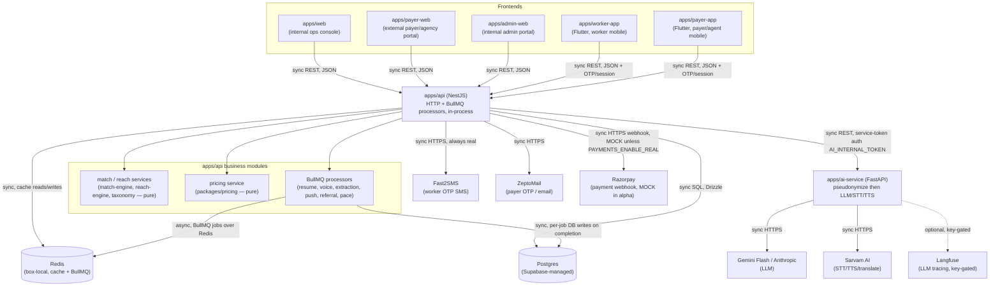

# API Route Map — System Topology

Component-level view of how requests flow through badabhai-platform. This is the *shape* of
the system; the exhaustive per-route table (method, path, controller, auth, DB tables, test
coverage, criticality class) lives in
[`docs/audit/03_API_INVENTORY.md`](../audit/03_API_INVENTORY.md).

See [`API_ROUTE_MAP.mmd`](API_ROUTE_MAP.mmd) for the diagram source (renders inline below on
GitHub/most Markdown viewers).

## Edge notes

- **Frontends → apps/api**: all five frontends (2 internal Next.js consoles, 1 external
  Next.js payer portal, 2 Flutter mobile apps) talk to `apps/api` only, synchronously over
  REST/JSON. No frontend holds `AI_SERVICE_URL`, DB credentials, or provider keys — that
  config key exists only in `packages/config/src/server.ts` (server-only); frontends import
  `packages/config/src/public.ts` (browser-safe half) instead.
- **apps/api → apps/ai-service**: synchronous REST, server-to-server only, gated by the TD67
  `AI_INTERNAL_TOKEN` bearer middleware on every ai-service route except `/health`. apps/api
  degrades to an in-process TypeScript mock when ai-service is unreachable or
  `AI_ENABLE_REAL_CALLS` is off — a designed fallback (`apps/api/src/ai/ai.service.ts`), not a
  failure mode.
- **apps/ai-service → Gemini/Anthropic/Sarvam**: synchronous HTTPS, always
  pseudonymization-first (per the service's own module docstring: pseudonymization runs before
  any external LLM path on every endpoint that could reach an LLM). Real spend only when
  `GEMINI_FLASH_API_KEY`/`AI_ENABLE_REAL_CALLS` are actually configured; otherwise mocked.
- **apps/api ↔ Postgres**: synchronous, all reads/writes, RLS-enforced for `anon`/
  `authenticated`/`service_role`. No other component touches Postgres directly.
- **apps/api ↔ Redis**: dual role — synchronous cache access, and the BullMQ queue backend.
  Because BullMQ processors run **in-process** inside the same Nest app
  (`apps/api/src/queue/queue.module.ts` states this explicitly as a Phase 1 choice), the
  "async" edge here is a job enqueue/dequeue within the same deployed container — there is no
  independently deployed worker process today.
- **apps/api → Fast2SMS**: synchronous, always real — no mock/dev-echo path exists for worker
  OTP (a fail-closed design choice, not a gap).
- **apps/api → ZeptoMail**: synchronous, real-by-default for payer OTP/email — the subject of
  this branch's own recent fixes (#813/#814/#819, `ZEPTOMAIL_API_URL` wiring through compose +
  the CI secrets bridge).
- **apps/api → Razorpay**: synchronous webhook *receiver* (Razorpay calls apps/api on payment
  events, not the other way around); `PAYMENTS_ENABLE_REAL` defaults false, so this edge is
  currently MOCK-only in the deployed environment.
- **apps/ai-service → Langfuse**: optional, synchronous tracing, dormant unless both Langfuse
  keys are configured — no evidence they're set in the staging deploy's secret list.

## Notable finding

`packages/reach-learn` (the ADR-0017 offline learn-to-rank layer) has **zero consumers**
anywhere in `apps/api` — confirmed dormant, and consistent with its own documented
"offline/shadow only, no live ranking influence" scope. Recorded here so it isn't independently
misclassified as a dead/orphaned package later — it's deliberately inert.

## Maintenance

Update this file (and `API_ROUTE_MAP.mmd`) whenever a PR adds/removes/moves a top-level
component or changes an edge between them (e.g. a new external provider, a queue moving to a
separate deployed worker, a frontend gaining a new backend). Per-route detail changes belong in
`docs/audit/03_API_INVENTORY.md`, not here. See
[`docs/architecture/PR_ARCHITECTURE_UPDATE.md`](PR_ARCHITECTURE_UPDATE.md) (Batch 2) for the
planned PR checklist that will formalize this.
